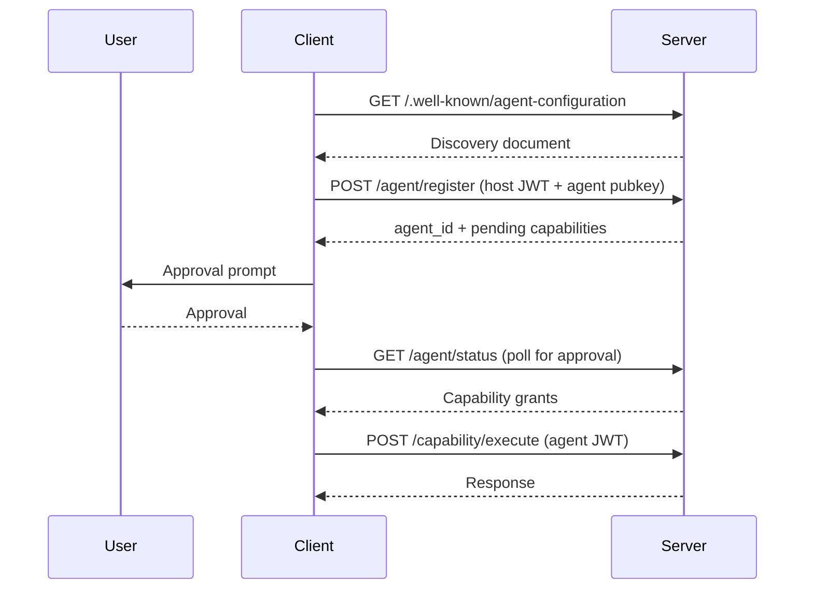

<GetStartedBlock />

Agent Auth is an open protocol that gives AI agents their own identity. Instead of borrowing a user's OAuth token or sharing a single API key, each agent gets its own cryptographic keypair, its own granted capabilities, and its own lifecycle.

Using Agent Auth, AI applications like Claude, ChatGPT, or Cursor can connect to external services — banks, APIs, deployment pipelines, communication tools — and perform tasks with **clear attribution and scoped permissions**.

## The problem

Every auth model we've built for the web — OAuth, sessions, API keys — assumes two kinds of actors: a human user and a static application, with predefined scopes. Agents are neither.

They range from ephemeral one-shot tasks to long-running background workers and multi-step systems, calling external services without constant human interaction, sometimes on behalf of a user, sometimes entirely on their own.

### Delegated agents

When an agent acts on behalf of a user, it typically reuses the user's OAuth token or a shared client credential. That collapses the agent into the user's identity:

- **No visibility** — the server can't tell which agent made a request
- **No scoping** — every agent gets the user's full permissions
- **No isolation** — you can't revoke one agent without revoking all of them

### Autonomous agents

When an agent needs to act on its own — without a user in the loop — there is no identity model for it. The agent is forced to pretend to be a human user: opening a browser, solving a CAPTCHA, and clicking through a signup flow just to use a service. There is no standard way for an agent to register itself, prove its identity, or receive capabilities without impersonating a person.

## What Agent Auth does

Agent Auth makes each runtime agent a first-class principal. Instead of borrowing someone else's identity, each agent is registered with its own identity, granted capabilities, and lifecycle.

- **Per-agent identity** — every agent gets its own ID and cryptographic keys
- **Scoped capabilities** — agents only get access to the specific actions they need
- **User-controlled approval** — capabilities are approved through device authorization, CIBA, or other server-supported methods
- **Independent lifecycle** — each agent can be revoked or expired without affecting others
- **Full audit trail** — every action is attributed to a specific agent
- **Discovery** — agents find services automatically via well-known endpoints and directory search

## How it works

The core flow is simple:

1. A **client** (e.g. an MCP server, SDK, or CLI) discovers a service via its well-known endpoint
2. The client registers an **agent** with the service's authorization **server**
3. The user approves the agent's requested capabilities
4. The agent authenticates with short-lived Ed25519-signed JWTs on every request

Agent Auth works alongside existing standards — it uses OAuth's device flow and CIBA for approval, follows DPoP-style proof-of-possession patterns, and is designed to be the auth layer for MCP.

## Learn more

- [Servers — authorization and capability management](/docs/servers)
- [Client — the agent-server bridge](/docs/client)
- [Agents — runtime AI actors](/docs/agents)
- [Build a server — get started with Better Auth](/docs/build-server)
- [Full specification](/specification) — covers identity, registration, authentication, capabilities, approval, discovery, and lifecycle
