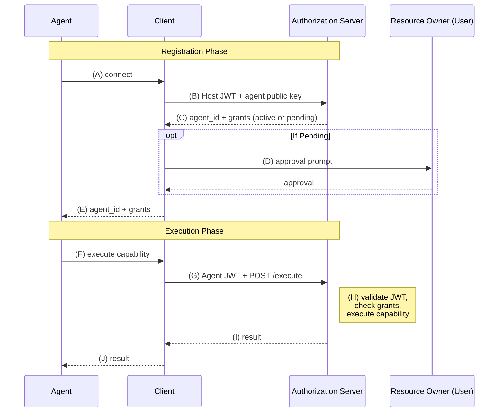

# Agent Auth Protocol

**Authors:** Paola Estefanía de Campos, Bereket Engida

**Version:** v1.0-draft

This document is an implementation-oriented comprehensive agent authentication and working draft. It is designed to be adoptable by products and platforms today, with built-in support for existing infrastructure including HTTP APIs, OpenAPI operations, and MCP tools. The protocol has an official [implementations](/docs/sdks) covering all parts of this specification, maintained by the team behind [Better Auth](https://better-auth.com).

## 1. Introduction

### 1.1 Problem Statement

AI agents are becoming long-lived actors: copilots, background workers, scheduled automations, and multi-step systems that call external services without constant human supervision. Today's auth models were not designed with this in mind. The problem breaks down into three areas.

1. Agents acting on behalf of a user (Delegated agents)

When an agent acts on behalf of a user, it typically inherits the identity of the application or the user — operating under existing OAuth client credentials or delegated tokens with no way to identify the agent as a separate principal. That collapses the runtime agent into someone else's identity.

- **No visibility.** The server can't tell which agent made a request. There's no audit trail per agent — every call looks like it came from the same OAuth client.
- **No scoping.** You can't scope each agent separately. Every agent sharing the same credential gets the same permissions. You can't give one agent read-only access and another write access, or constrain a specific agent to a narrower set of capabilities for a limited time.
- **No isolation.** You can't revoke one agent without revoking all of them. A compromised agent means rotating credentials for everything.

2. Agents operating without a human in the loop (Autonomous agents)

Existing auth models tightly couple the human user and the application. When an agent needs to act on its own — without a user in the loop — there is no identity model for it. The agent is forced to pretend to be a human user: opening a browser, solving a CAPTCHA, and clicking through a signup flow just to use a service. There is no standard way for an agent to register itself, prove its identity, or receive capabilities without impersonating a person.

3. Discovery

There is no standard way for a service to advertise that it supports agents, what capabilities it offers, or how an agent should begin authenticating. Every new integration requires hardcoded configuration, prior training data, or a human pointing the agent to the right endpoint. Agents cannot arrive at an arbitrary service and programmatically orient themselves.

### 1.2 The Identity Problem

The problems above share a single root cause: agents today do not have identity.

An agent is the specific runtime AI actor within that environment: a particular conversation, task, or session that acts over time. Two separate chats in the same application are not "the same agent", they have different contexts, different intents, and should have different permissions.

Identity requires two properties:

- **Continuity** — recognizable as the same actor over time. The server can verify, across multiple requests, that it is dealing with the same agent it registered.
- **Distinctiveness** — distinguishable from every other actor. Each agent can be individually identified, scoped, audited, and revoked without affecting any other.

Existing auth models fail because they provide at most one of these properties. OAuth tokens give continuity (the same token across requests) but no distinctiveness (every agent behind a client looks identical). Stateless API keys give distinctiveness (you can issue many) but weak continuity (no lifecycle, no state transitions, no revocation boundary). Neither gives an agent an identity, just a credential.

### 1.3 Solution

Agent Auth makes the runtime agent a first-class principal with both properties. Instead of borrowing a user's session or a shared application token, each agent is registered with its own identity, granted capabilities, and lifecycle. Every agent is created under a persistent identity called a **host** (§2.7), which the **client** (§6) registers with each server it connects to.

When the agent needs to act, it authenticates with short-lived signed JWTs tied to that registration. This gives the server something existing auth models are missing: a durable way to identify which specific agent is acting, which host it belongs to, what mode it runs in, what capabilities it holds, and how to suspend, expire, or revoke it without affecting everything else.

### 1.4 Conformance

The key words "MUST", "MUST NOT", "REQUIRED", "SHALL", "SHALL NOT", "SHOULD", "SHOULD NOT", "RECOMMENDED", "NOT RECOMMENDED", "MAY", and "OPTIONAL" in this document are to be interpreted as described in BCP 14 [RFC 2119](https://datatracker.ietf.org/doc/html/rfc2119) [RFC 8174](https://datatracker.ietf.org/doc/html/rfc8174) when, and only when, they appear in capitalized form, as shown here.

### 1.4.1 Type Notation

In tables throughout this specification, a trailing `?` on a type (e.g. `string?`) indicates the field is **nullable** — it may be present with a `null` value. This is distinct from "optional" (the field may be omitted entirely). A field marked as nullable and optional (e.g. `string?` with Required = "No") may be either absent or present with a `null` value.

### 1.5 Terminology
- **Principal** — An identity the server can authenticate, authorize, audit, and revoke independently. In this protocol, both hosts and agents are principals.
- **Agent** — A runtime AI actor scoped to a specific conversation, task, or session that calls external services. Each agent is registered under a host (§2.7), carries its own server-side identity, granted capabilities, and lifecycle, and authenticates with short-lived signed JWTs (§4.3).
- **Client** — The process that holds a host identity and exposes protocol tools to AI systems (MCP server, CLI, SDK). It manages host and agent keys, talks to servers, and signs JWTs. AI tools like Claude Code or ChatGPT connect to a client.
- **Host** — The persistent identity of the client environment where agents run. Each agent is created under a host. A host represents a specific device, application, or runtime on a server, and agents are registered under it. It may be linked to a user or unlinked in the case of autonomous agents.
- **Server** — The service's authorization server. It manages discovery, host and agent registrations, approvals, capability grants, and JWT verification. Also called the auth server.
- **Capability** — A server-offered action or function that an agent can execute. It is identified by a `name` and a human-readable `description`.
- **Agent Capability Grant** — A stored grant of one capability to one agent. Carries per-capability state and metadata.
- **Default capabilities** — The set of capabilities a host or agent is pre-authorized to execute without additional user approval or as a server-side policy.
- **Registration** — The process by which a client registers an agent identity under a host on a server. A successful registration results in an agent identity and capability grants (see §5.3).
- **Reactivation** — Bringing an expired agent back to `active` state. A security checkpoint: capabilities decay to host defaults and lifetime clocks reset.
- **Approval** — User consent for registration, trust establishment, account linking, or capability escalation. Required when server policy does not allow the request to be auto-approved.
- **Mode** — How an agent was registered: `"delegated"` (acting on behalf of a user) or `"autonomous"` (operating without a user in the loop).
- **Linked host** — A host linked to a user. A linked host MAY auto-approve delegated agents within its default capability set.
- **Host JWT** — A JWT signed with the host's private key. Used for host-authenticated requests such as registration, discovery with identity, status checks, and management operations.
- **Agent JWT** — A short-lived JWT signed with the agent's private key. Used to authenticate capability execution and other agent-authenticated requests.


### 1.6 Architecture

The protocol defines three runtime participants and two identity types:

**Runtime participants**

| Name | Role |
|---|---|
| **Agent** | The AI that needs to act. Has an agent ID and calls client tools. |
| **Client** | The process that exposes protocol tools to AI systems (MCP server, CLI, SDK). Holds a host identity, manages keys, and signs requests. |
| **Server** | The service's authorization server. Manages registrations, capabilities, approvals, and verification. |

**Identity types**

| Name | Role |
|---|---|
| **Host** | The client's persistent identity on a server: a keypair plus metadata. The server associates default capabilities, trust, and optionally a linked user with it. |
| **Agent** | A per-agent identity used for authenticated capability execution after registration. |

The host is an identity record and credential set, not a running process. A client uses a host identity when registering agents, checking status, or performing host-authenticated operations.

Each agent is created under a host. This lets the server reason separately about the persistent client identity (`host`) and the runtime actor (`agent`). The details of host establishment, linking, and key distribution are defined in §2.7–§2.11 and §4.

### 1.7 Protocol Flow



*Figure 1: Agent Auth Abstract Protocol Flow*

- **(A)** Agent requests connection via client tools (`connect_agent` with requested capabilities, reason, and mode).
- **(B)** Client registers agent with the authorization server, presenting a host JWT containing the agent's public key and requested capabilities.
- **(C)** Authorization server returns agent ID and capability grants — either active (auto-approved) or pending (approval required).
- **(D)** If pending, the client facilitates user approval via the server's chosen method — device authorization ([RFC 8628](https://datatracker.ietf.org/doc/html/rfc8628)), [CIBA](https://openid.net/specs/openid-client-initiated-backchannel-authentication-core-1_0.html), or another supported method (§7). The client polls for completion.
- **(E)** Client returns agent ID and granted capabilities to the agent.
- **(F)** Agent calls `execute_capability` (§6.10) on the client with a capability name and arguments.
- **(G)** Client signs a short-lived agent JWT and sends the execution request to the capability's location (§2.15).
- **(H)** The service at the location validates the JWT (including `aud` match), checks the agent's granted capabilities, and executes the requested capability.
- **(I)** The service returns the execution result to the client.
- **(J)** Client returns the result to the agent.

Agents that need a raw JWT for direct server-to-server use can still call `sign_jwt` (§6.5). Resource servers that validate agent JWTs directly MAY use introspection (§5.12) or local verification as described later in the spec, but that is an alternative path rather than the standard capability-execution flow shown above.

**Notes:**

- **Discovery is a pre-step for generic clients.** Multi-provider clients MAY call `list_providers` (§6.2.1), `search_providers` (§6.2.2), and `discover_provider` (§6.2.3) before step (A).

## 2. Core Model

### 2.1 Agent

An agent is a runtime AI actor scoped to a specific conversation, task, or session, that calls external services. Each agent is registered under a host (§2.7–§2.11), carries its own server-side identity, granted capabilities, and lifecycle, and authenticates with short-lived signed JWTs (§4.3).

### 2.2 Agent Modes

An agent operates in one of two modes, which determines its relationship to a user. The mode is chosen at registration and cannot be changed after creation.

#### 2.2.1 Delegated Agents

In delegated mode (`"delegated"`, default), the agent acts on behalf of a specific user. The user sees what the agent is requesting and decides what to allow. This is the common case: a user's copilot, assistant, or tool-calling agent.

**Example.** An email assistant that requests permission to read your inbox and send replies on your behalf.

#### 2.2.2 Autonomous Agents

In autonomous mode (`"autonomous"`), the agent operates without a user in the loop. Capabilities are granted by server policy or administrator approval, not by an end user. Use cases include background workers, scheduled automations, service-to-service agents, and agents that bootstrap before any user interaction. If the agent is later claimed by a user, it transitions to `"claimed"` state (§2.10).

**Example.** A deployment agent that signs up for an infrastructure API, provisions resources, and deploys a website without waiting for a user to approve each step.

A server MAY support delegated agents, autonomous agents, or both. Servers advertise supported modes via discovery (§5.1) and MUST reject registration requests for any unsupported mode.

**Sub-agents.** This protocol's identity model treats a sub-agent as part of its parent agent — they share the same credentials, capabilities, and user context, so they are the same principal. A single agent MAY issue concurrent requests with the same JWT.

### 2.3 Agent States

Every agent is in exactly one state at any time. Only `active` agents can authenticate and make requests.

| State | Description |
|---|---|
| `pending` | Awaiting user approval. Cannot authenticate. |
| `active` | Operational. Each request extends the TTL. |
| `expired` | Session TTL or max lifetime elapsed. Re-approval required to reactivate. |
| `revoked` | Permanent. Cannot be reactivated. |
| `rejected` | User denied the registration. |
| `claimed` | Autonomous agent claimed when its host was linked to a user (§2.10). Capabilities revoked, agent archived. Activity history attributed to the user. Terminal state. |

### 2.4 Lifetime Clocks

Three independent clocks govern agent lifetimes. The durations are server policy — the server MAY vary them per agent based on mode, host, capabilities, or any other criteria.

- **Session TTL** protects against abandoned agents. It is measured from the last request. If the agent stops making requests, it becomes `expired`.
- **Max lifetime** caps continuous use. It is measured from the last activation. Even if the agent remains active, once this duration elapses it becomes `expired` and must be re-authorized. This prevents compromised agents from running indefinitely.
- **Absolute lifetime** is a hard limit from creation. Once elapsed, the agent becomes `revoked` permanently — it cannot be reactivated. A new agent must be created.

**Example:** Suppose a server uses a 30-minute session TTL, a 24-hour max lifetime, and a 7-day absolute lifetime. If the agent stops making requests for 30 minutes, it becomes `expired`. If it stays continuously active for 24 hours, it also becomes `expired` and must be reactivated. Once 7 days have passed since creation, it becomes `revoked` permanently and cannot be reactivated.

### 2.5 Reactivation

An expired agent MAY be reactivated, but reactivation is a security checkpoint. On reactivation, the agent returns to its baseline capabilities; any previously escalated capabilities are removed and MUST be requested again.

Reactivation resets the session TTL and max lifetime clocks. It does NOT reset the absolute lifetime clock. If the agent's absolute lifetime has already elapsed, reactivation MUST fail.

The full reactivation mechanics — including which capabilities are auto-approved and which require user approval — are defined in §5.6.

### 2.6 Revocation

An agent can be revoked by:
- **Itself** — the agent requests its own revocation through the client, which uses its host JWT to call `POST /agent/revoke` (§5.7) on the agent's behalf
- **Its host** — the host under which the agent is registered
- **The owning user** — through the server's management UI or API
- **An admin** — as defined by the server

Revocation is permanent — a revoked agent cannot be reactivated. The specific endpoints and mechanisms are defined in §5.7 and §6.7. Host revocation and its effect on agents is covered in §2.7–§2.11.

**User deletion.** When a user account is deleted, the server MUST revoke all hosts linked to that user and cascade revocation to all agents under those hosts (§8.5). The server SHOULD also clean up any pending approvals, capability grants, and activity logs associated with the user in accordance with the server's data retention policy (§9.2).

### 2.7 Host

A host is the persistent identity of the client environment where agents run. Conceptually, it represents the place the agent is running from: for example, a local Claude Code session on your laptop, a Cursor installation on your desktop, a ChatGPT connector runtime, a background worker, or any other client that manages agents and talks to servers. On the server, that environment is represented as a registered keypair plus metadata.

Every agent is registered under a host. This lets the server reason about the long-lived client environment (`host`) separately from the individual runtime agent (`agent`). For autonomous agents, a host MAY exist without any linked user. For delegated agents, a host MUST be linked to at most one user.

Hosts carry default capabilities, and agents registered under them can be granted those capabilities without additional approval or as a server-side policy.

### 2.8 Host Establishment

Hosts are established in one of two ways:

1. **Dynamic registration** — the host is first seen as part of agent registration (§5.3). If the host is unknown, the server creates it in `pending` state and waits for user approval.
2. **Pre-registration** — the host is registered before any agent exists. A user or administrator pre-registers the host through the server's dashboard, admin API, or any other server-specific mechanism.

In both cases, the result is the same host record: a host keypair (or JWKS URL), an optional linked user, and a set of default capabilities. A host without a linked user MAY provision autonomous agents.

### 2.9 Host Linking

Linking binds an unlinked host to a specific user. It happens through one of two mechanisms:

1. **Server-side linking** — the server links the host through its own dashboard, admin API, or any implementation-specific mechanism (e.g. a desktop app, browser extension, or local daemon running on the device).
2. **Delegated registration approval** — an unknown host registers a delegated agent (§5.3). The user approves the registration, and the server links the host to the approving user.

Once linked, future delegated agents through this host can be auto-approved for the host's default capabilities. A host MUST NOT be linked to more than one user.

**Host unlinking.** A server MAY allow a user to unlink a host (e.g. through a dashboard "disconnect app" action). When a host is unlinked, the server MUST revoke all delegated agents under that host, since they derived their authority from the now-removed user linkage. The host itself returns to an unlinked state and MAY continue to provision autonomous agents if the server's policy allows it. Servers that do not support host unlinking SHOULD require the user to revoke the host entirely instead.

**Account switching.** To switch a host to a different user account, the client unlinks the host (revoking all agents), then re-links to the new user through the same linking mechanisms above. The host retains its `host_id` and key material across the unlink/re-link cycle — only the `user_id` binding changes. After re-linking, agents MUST be re-registered under the new user context.

### 2.10 Autonomous Agent Claiming

When a host becomes linked, all active autonomous agents under that host MUST be claimed:

1. Each autonomous agent's capabilities are revoked
2. Each autonomous agent's status is set to `"claimed"`
3. Each autonomous agent's activity history is attributed to the user
4. Any resources created or owned by the autonomous agent SHOULD be transferred to the user

Once claimed, the autonomous agent is terminal — it cannot be reactivated. If the user wants to continue using the service, the host registers a new delegated agent. Servers MAY use a system account or anonymous placeholder to hold autonomous agent ownership until a real user claims it.

### 2.11 Host States

Every host is in exactly one state at any time.

An `active` host MAY register agents. A `pending` host MAY also register agents, but any agent registered under a `pending` host MUST remain `pending` until the host is approved.

A host in a terminal state MUST NOT be used to register agents. If a host is revoked or rejected, all agents under it MUST also be revoked or rejected.

| State | Meaning |
|---|---|
| `active` | Operational. Can be used to register agents. |
| `pending` | Awaiting approval. |
| `revoked` | Permanently disabled. |
| `rejected` | Approval was denied. |

### 2.12 Capabilities

Capabilities are the protocol's unit of authorization. A capability is a server-offered action described by a stable identifier and a human-readable description. Registration requests, capability grants, and JWT restriction all operate on capability names.

This section defines the capability model itself: what a capability is and what fields it carries. The server endpoint used to list capabilities is defined later in §5.2.

It is useful to distinguish two related concepts:

- **Capability** — what the server offers
- **Capability grant** — what an agent is granted to execute and in what conditions

The same capability name can appear in different parts of the protocol for different reasons. It can be requested by an agent, granted by the server, included in a host's defaults, or used to limit a specific JWT. The capability name identifies the action itself; the surrounding context determines how it is being used.

**Core fields** (protocol-level):

- `name` (`string`, required): Stable agent-facing capability identifier.
- `description` (`string`, required): Human-readable description of what this capability does.
- `location` (`string`, optional): The URL where this capability is executed. The client sends the execute request (agent JWT + capability name + arguments) to this URL, and sets the JWT `aud` claim to match it (§4.3). If absent, the client uses the server's `default_location` from discovery (§5.1).
- `input` (`object`, optional): A JSON Schema describing the shape of the execution arguments a capability requires.
- `output` (`object`, optional): A JSON Schema describing the shape of the data returned when this capability executes successfully. Agents use this to reason about what information a capability provides, plan multi-step workflows, and chain capability outputs into other capabilities' inputs without trial and error.
- `grant_status` (`string`, optional): Enum indicating whether the capability has been granted to the agent. Present only when the request is authenticated with an agent JWT.

**Example capability (with custom location):**

```json
{
  "name": "check_balance",
  "description": "Check the balance of a bank account",
  "location": "https://banking-api.example.com/agent/execute",
  "input": {
    "type": "object",
    "required": ["account_id"],
    "properties": {
      "account_id": {
        "type": "string",
        "description": "The bank account ID to check"
      }
    }
  },
  "output": {
    "type": "object",
    "properties": {
      "account_id": { "type": "string" },
      "balance": { "type": "number" },
      "currency": { "type": "string" }
    }
  },
  "grant_status": "granted"
}
```

**Example with no arguments:**

```json
{
  "name": "list_accounts",
  "description": "List all bank accounts for the linked user",
  "output": {
    "type": "array",
    "items": {
      "type": "object",
      "properties": {
        "account_id": { "type": "string" },
        "name": { "type": "string" },
        "type": { "type": "string", "enum": ["checking", "savings"] }
      }
    }
  }
}
```

**Capability removal.** A server MAY remove or rename capabilities at any time. Existing grants for a removed capability become inoperative — the server MUST NOT execute them. When an agent attempts to execute a removed capability, the server MUST return `403` with error code `capability_not_granted`. Servers SHOULD include a human-readable `message` indicating the capability was removed (e.g. `"The capability 'transfer_domestic' has been removed"`). The protocol does not require servers to proactively notify hosts or agents when capabilities are removed — agents discover the change on the next execution attempt or capability listing.

### 2.13 Scoped Grants (Constraints)

A capability grant MAY carry **constraints** — restrictions on the input values an agent is authorized to supply when executing the capability. Constraints turn a broad capability into a narrow, specific authorization: instead of granting "transfer money" with no limits, the server can grant "transfer up to $1,000 in USD to account acc_456."

Constraints are stored per grant on the agent capability grant record (§3.3). They use the capability's **top-level** input field names as keys — nested paths (e.g. `"address.country"`) are not supported. A grant without constraints permits any valid input — constraints are purely additive.

**How constraints are established:**

1. **Agent-proposed.** The agent includes constraints in its capability request (§5.3, §5.4). The user sees the scoped request on the approval screen — for example, "Agent wants to transfer $500 to acc_456" — and approves or denies that specific scope.
2. **Server-imposed.** The server MAY add or narrow constraints as policy, independent of what the agent requested. For example, the server may cap all transfer grants at $10,000 even if the agent didn't propose a limit.
3. **Combined.** The server takes the intersection — the tightest constraint from either source wins.

The server MUST NOT widen constraints beyond what the agent requested without a new approval. The server MAY narrow them. Clients SHOULD compare the constraints returned in the grant against what they originally proposed — if the server returned wider constraints than requested (indicating a server bug or compromise), the client SHOULD warn the user or refuse the grant.

**Constraint value format:**

Constraint values use one of two forms:

- **Exact value** — `"field": value`. The agent MUST supply exactly this value for the field. Shorthand for equality.
- **Operator object** — `"field": { "op": value }`. The agent's supplied value must satisfy the operator.

Supported operators:

| Operator | Type | Meaning |
|---|---|---|
| `max` | number | Value must be ≤ `max` |
| `min` | number | Value must be ≥ `min` |
| `in` | array | Value must be one of the listed values |
| `not_in` | array | Value must not be one of the listed values |

Operators MAY be combined on a single field: `{ "min": 0, "max": 1000 }` means the value must be between 0 and 1000 inclusive. Exact values and operator objects MUST NOT be combined on the same field.

**Unknown operators.** If a server encounters a constraint operator it does not recognize (e.g. from a future protocol extension or a client proposing new operators), the server MUST reject the grant or execution request with `400 unknown_constraint_operator` rather than silently ignoring the unknown operator. Ignoring an unknown constraint could grant broader access than intended. The error response SHOULD include an `unknown_operators` array listing the unrecognized operator names. Clients receiving a grant with unknown operators SHOULD treat the constraint as opaque and not attempt to interpret it locally.

**Example: constrained grant**

```json
{
  "capability": "transfer_money",
  "status": "active",
  "constraints": {
    "destination_account": "acc_456",
    "amount": { "min": 0, "max": 1000 },
    "currency": { "in": ["USD", "EUR"] }
  },
  "description": "Transfer funds domestically",
  "input": {
    "type": "object",
    "required": ["amount", "currency", "destination_account"],
    "properties": {
      "amount": { "type": "number" },
      "currency": { "type": "string" },
      "destination_account": { "type": "string" }
    }
  }
}
```

This grant allows transfers of up to $1,000 in USD or EUR, but only to account `acc_456`. Any execution that violates these constraints is rejected with `constraint_violated` (§5.11).

**Unconstrained grants** — grants without a constraints field — allow the agent to supply any valid arguments.

### 2.14 Capability Naming

Capability names are opaque strings at the protocol layer. Clients and agents MUST treat capability names as uninterpreted identifiers for authorization and execution.

Capability names should only include lowercase ASCII alphanumeric characters and underscores (`[a-z0-9_]+`). They should be human-readable and use a consistent `snake_case` convention within a provider or product.

**Examples:** `list_accounts`, `check_balance`, `transfer_money`

### 2.15 Execution

To execute a capability, the client resolves the target **location**: the capability's `location` field if set, otherwise the server's `default_location` from discovery (§5.1). The client signs an agent JWT with `aud` set to the resolved location URL (§4.3), then sends the capability name and arguments to that location via `POST`.

**Request flow:**

```
Agent → Client (execute_capability) → Location (POST with JWT + capability + arguments)
                                   ← result
```

The service at the location validates the agent JWT — verifying that `aud` matches its own URL — checks that the agent has been granted the capability, and processes the request.

When the location is the server's own execute endpoint (the default), the server acts as a gateway: it validates the JWT, checks grants, executes the capability against its backend, and returns the result. When the location is a separate service, that service is responsible for JWT validation and grant verification (via introspection §5.12 or local verification). Either way, the client sends the same payload to the same contract — only the destination URL changes.

**Interaction modes:**

Capabilities MUST operate in one of the following modes, controlled by the service at the location:

- **Sync** (default) — the service executes the capability and returns the result in the response body.
- **Stream** — the service returns a streaming response (e.g. Server-Sent Events). The client SHOULD expose the stream to the agent when the transport supports it.
- **Async** — the service returns `202 Accepted` with a status URL for polling. The response MUST include a status value (`"pending"`, `"completed"`, or `"failed"`). When `"completed"`, the response SHOULD include a result payload. When `"failed"`, the response SHOULD include an error object per §5.13. The service MAY include a `Retry-After` header or a retry-after value (in seconds).

The service at the location determines the interaction mode for each capability. The agent does not need to know — the client and service handle it.

## 3. Data Model

This section defines the logical fields the protocol operates on. Implementations MAY store these fields however they choose, as long as the protocol-facing behavior is preserved.

### 3.1 Host

| Field | Type | Description |
|---|---|---|
| `id` | string | Unique identifier |
| `name` | string? | Human-readable name for the host (e.g. `"MacBook-Pro"`, `"CI Server"`). Informational only — servers MUST NOT use it for authorization. |
| `public_key` | JWK? | Ed25519 public key (see §4.1). Present when inline key registration is used. |
| `jwks_url` | string? | JWKS endpoint URL. Present when JWKS-based registration is used. |
| `user_id` | string? | ID of the owning user in the server's auth system. Set when a user approves and trusts the host. Drives authorization (revocation, management). |
| `default_capabilities` | string[] | Default capabilities for agents registered under this host |
| `status` | enum | active, pending, revoked, rejected |
| `activated_at` | datetime? | Last activation |
| `expires_at` | datetime? | TTL deadline |
| `last_used_at` | datetime? | Last host JWT usage |
| `created_at` | datetime | Created |
| `updated_at` | datetime | Last modified |

Clients SHOULD auto-detect the `name` from available context (e.g. device hostname, client name) and pass it as `host_name` during agent registration (§5.3).

### 3.2 Agent

| Field | Type | Description |
|---|---|---|
| `id` | string | Unique identifier |
| `name` | string | Human-readable name for the agent |
| `host_id` | string (FK) | The host this agent is registered under (**required**) |
| `user_id` | string? (FK) | The single effective user context this agent acts on behalf of. Set from the host's `user_id` or session auth. Core protocol behavior assumes at most one effective `user_id` per agent at a time. |
| `public_key` | JWK? | Ed25519 public key (see §4.1). Present when inline key registration is used. |
| `jwks_url` | string? | JWKS endpoint URL. Present when JWKS-based registration is used. |
| `status` | enum | active, pending, expired, revoked, rejected, claimed |
| `mode` | string | `"delegated"` or `"autonomous"`. Immutable after creation (§2.2). |
| `last_used_at` | datetime? | Last authenticated request |
| `activated_at` | datetime? | Last activation |
| `expires_at` | datetime? | TTL deadline |
| `created_at` | datetime | Created |
| `updated_at` | datetime | Last modified |

### 3.3 Agent Capability Grant

Agent capabilities are stored as individual agent capability grant records rather than flat arrays on the agent. This enables per-capability metadata (expiry, grant source, reason) and granular revocation.

| Field | Type | Description |
|---|---|---|
| `id` | string | Unique identifier |
| `agent_id` | string (FK) | The agent this capability grant belongs to |
| `capability` | string | The granted capability identifier |
| `status` | enum | `active`, `pending`, or `denied` |
| `constraints` | object? | Input constraints on this grant (§2.13). Keys are input field names; values are exact values or operator objects (`max`, `min`, `in`, `not_in`). Present only when the grant is scoped. |
| `granted_by` | string? (FK) | User or system actor who granted this capability. Informational for audit and revocation history — it does not change the agent's single effective `user_id`. |
| `denied_by` | string? (FK) | User or system actor who denied this capability. Present only when `status` is `denied`. |
| `reason` | string? | Why this capability was granted, requested, or denied. For denied grants, this is a human-readable explanation returned to the agent (§5.5). |
| `expires_at` | datetime? | When this specific capability grant expires (independent of agent TTL) |
| `created_at` | datetime | Created |
| `updated_at` | datetime | Last modified |

An agent's effective capabilities are all agent capability grants where `status = "active"` and `expires_at` is null or in the future. Pending capabilities are grants where `status = "pending"`.

Implementations MAY use flat arrays on the agent model instead of a separate table, but MUST support at minimum per-capability status tracking (active vs pending).

#### 3.3.1 Single-User Core Model

The core protocol models an agent as having one effective user context at a time (`agent.user_id`). A capability grant MAY still record a different `granted_by` value for audit purposes — for example, an admin or another authorized reviewer may approve a capability request — but that does not change which user the agent is acting for.

More advanced workflows where a single agent accumulates authority from multiple end users, targets specific users for approval, or selects a subject at execution time are not part of the core protocol. Those patterns are defined, if at all, by extension profiles such as the Cross-User Grant Profile (§10.10.1).

## 4. Authentication

### 4.1 Keypairs

Both hosts and agents use EdDSA over Ed25519 ([RFC 8037](https://datatracker.ietf.org/doc/html/rfc8037), [RFC 8032](https://datatracker.ietf.org/doc/html/rfc8032)) keypairs in JWK format.

- Algorithm: `EdDSA` with curve `Ed25519`
- The private key MUST never be sent to the server
- The server stores only public keys (or JWKS URLs)
- The agent's private key lives with the client

Public keys for both hosts and agents can be provided to servers in two ways:

- **Inline (JWK)** — sent directly during registration. Simplest case.
- **JWKS URL** — published at a URL the server can fetch. The URL MAY be served by the client itself, or by a service acting on the client's behalf (for example a broker or identity service). This is useful for key rotation and for avoiding manual public-key distribution across multiple verifier services. The private keys still live with the client or the service that controls that identity.

The `algorithms` field in discovery (§5.1) lists accepted key types for new registrations. In this specification version, the only defined value is `Ed25519`, and conformant clients and servers MUST support it. JWT signing still uses JWA `alg = EdDSA` with the `Ed25519` key type.

Removing an algorithm from the discovery list MUST NOT invalidate existing agents or hosts that registered with it.

### 4.2 Host JWT

Hosts authenticate by signing short-lived JWTs per [RFC 7519](https://datatracker.ietf.org/doc/html/rfc7519) with the host's private key. The JWT header MUST set `typ` to `host+jwt` and MUST include `kid` when using a JWKS URL. Servers MUST reject host-authenticated requests where the JWT `typ` is not `host+jwt`.

| Claim | Type | Required | Description |
|---|---|---|---|
| `iss` | string | Yes | Host identifier. MUST be the JWK thumbprint ([RFC 7638](https://datatracker.ietf.org/doc/html/rfc7638)) of the host's signing public key, computed using SHA-256. This is always the thumbprint of the key used to sign this JWT, regardless of whether the key is provided inline (`host_public_key`) or via JWKS (`host_jwks_url`). |
| `aud` | string | Yes | Server's `issuer` URL from discovery. |
| `iat` | number | Yes | Issued-at timestamp. |
| `exp` | number | Yes | Expiration timestamp. |
| `jti` | string | Yes | Unique token identifier. |
| `host_public_key` | JWK | Conditional | Inline host public key. Required unless `host_jwks_url` is provided. |
| `host_jwks_url` | string | Conditional | JWKS URL for the host's public keys. Required unless `host_public_key` is provided. Server matches by `kid` from the JWT header. |
| `agent_public_key` | JWK | Conditional | Inline agent public key. Required for registration (§5.3) unless `agent_jwks_url` is provided. Not required on other endpoints. |
| `agent_jwks_url` | string | Conditional | JWKS URL for the agent's public keys. Required for registration (§5.3) unless `agent_public_key` is provided. Not required on other endpoints. |
| `agent_kid` | string | Conditional | Key ID for the agent's key in the agent JWKS. Required when `agent_jwks_url` is provided. |

**Host identity and `iss` verification:**

- **Inline-key hosts** (`host_public_key`): The server identifies the host by `iss` (the key's thumbprint). For known hosts, `iss` MUST match the stored identifier. Key rotation via §5.9 updates the stored identifier atomically.
- **JWKS-based hosts** (`host_jwks_url`): The server identifies the host by the `host_jwks_url` value, which is stable across key rotations. The `iss` claim MUST still match the thumbprint of the signing key (identified by `kid` in the JWT header), but when the host rotates its signing key, `iss` changes. The server resolves this by looking up the host by `host_jwks_url`, then re-fetching the JWKS to discover the new key (see §8.7).
- **New hosts** (registration): The server MUST compute the JWK thumbprint of the presented signing key and verify it matches `iss` — reject if they differ.

**Example Host JWT payload (for registration):**

```json
{
  "iss": "NzbLsXh8uDCcd-6MNwXF4W_7noWXFZAfHkxZsRGC9Xs",
  "aud": "https://api.example.com",
  "iat": 1710000000,
  "exp": 1710000060,
  "jti": "h-abc123",
  "host_public_key": { "kty": "OKP", "crv": "Ed25519", "x": "host-pub-key..." },
  "agent_public_key": { "kty": "OKP", "crv": "Ed25519", "x": "agent-pub-key..." }
}
```

Host and agent JWKS URLs MUST point to different endpoints. Servers that fetch JWKS URLs MUST apply URL fetch protections (§8.12) and SHOULD cache previously fetched keys. Servers MUST accept host JWTs with or without agent key claims on non-registration endpoints.

### 4.3 Agent JWT

Agents authenticate by signing short-lived JWTs per [RFC 7519](https://datatracker.ietf.org/doc/html/rfc7519). The JWT header MUST set `typ` to `agent+jwt`. JWTs SHOULD expire within 60 seconds. Servers MUST reject agent-authenticated requests where the JWT `typ` is not `agent+jwt`.

| Claim | Type | Required | Description |
|---|---|---|---|
| `iss` | string | Yes | The host's identifier as known by this server — the JWK thumbprint of the host's current signing key (same value as the host JWT `iss`). Allows the server to resolve the agent's parent host without a database lookup on `sub` first. |
| `sub` | string | Yes | Agent ID. |
| `aud` | string | Yes | The URL of the intended recipient. For capability execution, this MUST be the resolved location URL — the capability's `location` if set, or the server's `default_location` from discovery (§5.1). For non-execution requests to the auth server (e.g. capability listing with grant status), this MUST be the server's `issuer` URL. The receiving service MUST reject JWTs where `aud` does not match its expected value. |
| `iat` | number | Yes | Issued-at timestamp. |
| `exp` | number | Yes | Expiration timestamp. |
| `jti` | string | Yes | Unique token identifier. |
| `capabilities` | string[] | No | Capability names this JWT is authorized for. If present, the server MUST reject requests for capabilities not in this list. If absent, the JWT is valid for all the agent's granted capabilities. |

**Example Agent JWT payload (execution at default location):**

```json
{
  "iss": "NzbLsXh8uDCcd-6MNwXF4W_7noWXFZAfHkxZsRGC9Xs",
  "sub": "agt_k7x9m2",
  "aud": "https://auth.bank.com/capability/execute",
  "iat": 1710000000,
  "exp": 1710000060,
  "jti": "a-xyz789"
}
```

**Example with custom location and capability restriction:**

```json
{
  "iss": "NzbLsXh8uDCcd-6MNwXF4W_7noWXFZAfHkxZsRGC9Xs",
  "sub": "agt_k7x9m2",
  "aud": "https://banking-api.example.com/agent/execute",
  "iat": 1710000000,
  "exp": 1710000060,
  "jti": "a-xyz790",
  "capabilities": ["check_balance", "list_accounts"]
}
```

### 4.4 Proof of Possession (Optional)

The base security model is short-lived JWTs over TLS. This is sufficient for most applications.

For higher-security deployments, servers MAY require a standard proof-of-possession profile:

- **DPoP ([RFC 9449](https://datatracker.ietf.org/doc/html/rfc9449))** — the client sends the agent JWT as the access token and a separate DPoP proof JWT in the `DPoP` header on each request. The agent JWT SHOULD include `cnf.jkt` (the JWK thumbprint of the DPoP proof key).
- **mTLS ([RFC 8705](https://datatracker.ietf.org/doc/html/rfc8705))** — the client authenticates with a TLS client certificate. The agent JWT SHOULD include `cnf.x5t#S256` to bind it to that certificate.

### 4.5 Verification

1. Verify the JWT header `typ` is `agent+jwt` — reject if it is not (prevents token confusion with host JWTs)
2. Extract `iss` and `sub` from JWT
3. Verify `aud` matches the server's own `issuer` URL — reject if it doesn't
4. Look up the host by `iss`. If not found, fall back to looking up the agent by `sub` first, then resolve its parent host — this handles the race window during JWKS key rotation where the agent uses the new `iss` before the server has updated the host's identifier (see §8.7). If the fallback was used, verify that `iss` corresponds to a valid key in the host's JWKS (the signature check in step 7 serves as this verification — if `iss` is not the thumbprint of the actual signing key, the signature will fail). Reject if the host is unknown, revoked, or pending.
5. Look up the agent by `sub` — verify the agent belongs to the resolved host
6. Check agent status — reject if revoked, expired, or pending
7. Verify JWT signature against the agent's stored public key (or JWKS)
8. Check `exp`, `iat`, `jti` replay
9. If proof of possession is required by server policy, validate the DPoP proof or mTLS binding and ensure it matches the JWT's `cnf` claim
10. Resolve the agent's granted capabilities
11. If `capabilities` claim is present in the JWT, intersect with granted capabilities — reject if the requested operation is not in the intersection
12. If the matching grant carries `constraints` (§2.13), validate that the request arguments satisfy all constraints — reject with `constraint_violated` if any are violated
13. Process the request

The server MUST ensure that revocation takes effect within a bounded window.

### 4.5.1 Host JWT Verification

Host-authenticated endpoints (`POST /agent/register`, `GET /agent/status`, `POST /agent/reactivate`, `POST /agent/revoke`, key rotation endpoints) MUST verify the host JWT as follows:

1. Verify the JWT header `typ` is `host+jwt` — reject if it is not
2. Extract `iss` from JWT
3. Verify `aud` matches the server's own `issuer` URL — reject if it doesn't
4. Look up the host:
   - **By `iss`** — if a host with this identifier is found, use it.
   - **By `host_jwks_url`** (fallback) — if `iss` is not recognized but the JWT contains `host_jwks_url`, look up the host by that URL. If found, this is a key rotation: re-fetch the JWKS, locate the key matching the JWT header `kid`, verify its thumbprint matches `iss`, and update the stored host identifier.
   - **Unknown host** — if neither lookup finds a match, this is a dynamic registration. Extract the signing key from `host_public_key` (or fetch from `host_jwks_url` using the JWT header `kid`). Compute the JWK thumbprint (RFC 7638, SHA-256) and reject if it does not match `iss`.
5. Verify JWT signature against the host's public key
6. Check `exp`, `iat` — reject if expired or issued in the future (see §8.2 for clock skew guidance)
7. Check `jti` replay — reject if the `jti` has been seen within the JWT's lifetime window
8. Check host status — reject if `revoked` or `rejected`. For `pending` hosts, only registration (§5.3) is allowed
9. If this is a registration request, extract the agent key claims (`agent_public_key` or `agent_jwks_url` + `agent_kid`) for agent creation
10. Process the request

For dynamic registration with an unknown host, the server MUST NOT trust the host identity until user approval completes (see §8.10).

### 4.6 Replay Detection

All JWTs MUST include `jti`. The server MUST cache seen values and reject duplicates within the JWT's max age window.

## 5. Server

Clients obtain the server configuration from discovery (§5.1). That configuration includes the server's `issuer` URL. All endpoint paths in this section are relative to that `issuer`.

The Server API is organized into the following groups:

- **Discovery** (§5.1) — how clients find the server's configuration
- **Capabilities and registration flow** (§5.2–§5.4) — capability discovery, registration, and capability requests
- **Lifecycle operations** (§5.5–§5.10) — status, reactivation, revocation, and key rotation
- **Execute capability** (§5.11) — standard capability execution endpoint
- **Introspection** (§5.12) — token introspection for resource servers
- **Error format** (§5.13) — standard error responses
- **Resource server challenge** (§5.14) — optional WWW-Authenticate hint for agents

---

### 5.1 Discovery

```
GET /.well-known/agent-configuration
```

Servers SHOULD publish this endpoint. No authentication required. Returns the service's Agent Auth configuration.

This endpoint enables generic clients to work with any Agent Auth server. Purpose-built clients (e.g. an MCP server built specifically for one service) MAY skip discovery and use pre-configured endpoints instead.

**Response:**

```json
{
  "version": "1.0-draft",
  "provider_name": "bank",
  "description": "Banking services — accounts, transfers, and payments",
  "issuer": "https://auth.bank.com",
  "default_location": "https://auth.bank.com/capability/execute",
  "algorithms": ["Ed25519"],
  "modes": ["delegated", "autonomous"],
  "approval_methods": ["device_authorization", "ciba"],
  "endpoints": {
    "register": "/agent/register",
    "capabilities": "/capability/list",
    "describe_capability": "/capability/describe",
    "execute": "/capability/execute",
    "request_capability": "/agent/request-capability",
    "status": "/agent/status",
    "reactivate": "/agent/reactivate",
    "revoke": "/agent/revoke",
    "revoke_host": "/host/revoke",
    "rotate_key": "/agent/rotate-key",
    "rotate_host_key": "/host/rotate-key",
    "introspect": "/agent/introspect"
  },
  "jwks_uri": "https://auth.bank.com/.well-known/jwks.json"
}
```

| Field | Type | Required | Description |
|---|---|---|---|
| `version` | string | Yes | Version of this protocol draft implemented by the server (e.g. `"1.0-draft"`). See §5.1.1 for versioning. |
| `provider_name` | string | Yes | Unique provider identifier. |
| `description` | string | Yes | Human-readable description of the service. Shown in `list_providers` results. |
| `issuer` | string | Yes | Base URL of the authorization server |
| `default_location` | string | No | The default URL where capability execution requests are sent. Capabilities that do not specify their own `location` (§2.12) are executed at this URL. The client uses this as the `aud` value in the agent JWT for execution requests. If not present, clients MUST derive it as `{issuer}{endpoints.execute}`. |
| `algorithms` | string[] | Yes | Supported key types for registration. In this spec version, only `Ed25519` is defined. |
| `modes` | string[] | Yes | Supported registration modes: `"delegated"`, `"autonomous"`, or both |
| `approval_methods` | string[] | Yes | How user approval works. Defined core values: `"device_authorization"` (RFC 8628), `"ciba"` (Client Initiated Backchannel Authentication). Servers MAY include additional custom methods defined by extension profiles (see §10.10.3). Clients SHOULD ignore methods they don't recognize. |
| `endpoints` | object | Yes | Server API endpoint paths, relative to `issuer` |
| `jwks_uri` | string | No | URL to the server's JWKS (JSON Web Key Set). Enables clients to verify server-signed responses in future protocol extensions. Servers that plan to sign responses SHOULD include this. |

Capabilities are listed via `/capability/list` (§5.2), described in detail via `/capability/describe` (§5.2.1), and executed at the capability's `location` or the server's `default_location` (§5.11). The discovery document covers identity and authorization configuration only.

Approval methods are negotiated through `POST /agent/register` (§5.3), `POST /agent/request-capability` (§5.4), and `POST /agent/reactivate` (§5.6). The server communicates the chosen method in the returned approval object — approval initiation is not a separate discovery-advertised endpoint in the core protocol.

**Caching.** Servers SHOULD include HTTP `Cache-Control` headers on the discovery response per [RFC 9111](https://datatracker.ietf.org/doc/html/rfc9111), following the metadata caching model established by [RFC 9728 §7.10](https://datatracker.ietf.org/doc/html/rfc9728#section-7.10) (OAuth 2.0 Protected Resource Metadata). A `max-age` of 3600 (one hour) is RECOMMENDED for most deployments. Clients MUST respect standard HTTP cache directives when present. When no `Cache-Control` header is present, clients SHOULD apply a default cache lifetime of one hour. See §10.5 for client-side caching guidance.

#### 5.1.1 Versioning

The `version` field identifies the draft version of the protocol, using the format `MAJOR.MINOR` with an optional `-draft` suffix (for example `"1.0-draft"`).

- Clients MUST check `version` before proceeding.
- If the major version is unsupported, the client MUST stop and report the incompatibility to the agent.
- Draft versions MAY introduce breaking changes between releases.
- Clients SHOULD ignore unrecognized fields in responses where possible.

### 5.2 List Capabilities

```
GET /capability/list
```

Returns a lightweight listing of capabilities the server offers. Each entry includes only the capability name, description, and, when authenticated with an agent JWT, grant status. For full capability details, including input and output schemas, use `GET /capability/describe` (§5.2.1).

Supports three authentication modes:

| Auth | What's returned |
|---|---|
| **No auth** | Public capabilities only (if the server exposes any) |
| **Host JWT** (`Authorization: Bearer <host_jwt>`) | Capabilities available to the host's linked user. Used before agent registration. |
| **Agent JWT** (`Authorization: Bearer <agent_jwt>`) | All capabilities with per-agent grant status (`"granted"` / `"not_granted"` on every returned capability). Used after agent registration. |

**Query parameters:**

| Parameter | Type | Required | Description |
|---|---|---|---|
| `query` | string | No | Search query to filter capabilities (e.g. `"send money"`, `"balance"`). Server-side matching — the server decides how to search (full-text, fuzzy, semantic, etc.). |
| `cursor` | string | No | Opaque pagination cursor from the previous response's next-page cursor |
| `limit` | number | No | Maximum capabilities to return. Server MAY enforce a cap (e.g. 100). Default is server-defined. |

**Example response (with agent JWT):**

```json
{
  "capabilities": [
    {
      "name": "check_balance",
      "description": "Check account balance",
      "grant_status": "granted"
    },
    {
      "name": "transfer_domestic",
      "description": "Transfer funds domestically",
      "grant_status": "granted"
    },
    {
      "name": "transfer_international",
      "description": "International wire transfer",
      "grant_status": "not_granted"
    }
  ]
}
```

**Example response (without auth or with host JWT):**

```json
{
  "capabilities": [
    {
      "name": "check_balance",
      "description": "Check account balance"
    },
    {
      "name": "transfer_domestic",
      "description": "Transfer funds domestically"
    },
    {
      "name": "transfer_international",
      "description": "International wire transfer"
    }
  ]
}
```

**Response parameters:**

| Field | Type | Required | Description |
|---|---|---|---|
| `capabilities` | array | Yes | Array of capability summary objects. Each object carries the fields defined in §2.12 (`name`, `description`, and `grant_status` when authenticated with an agent JWT). |
| `next_cursor` | string? | No | Opaque cursor for the next page. `null` if no more results. |
| `has_more` | boolean | No | `true` if more capabilities exist beyond this page. |

Pagination is optional — servers with a small capability set MAY return all capabilities in a single response with `has_more: false`. Clients MUST handle both paginated and non-paginated responses.

**Authentication required (optional):**

Servers whose capabilities depend entirely on user context (e.g. multi-tenant services with no public capability set) MAY return `401 Unauthorized` on unauthenticated requests instead of an empty list. The response SHOULD include a `WWW-Authenticate: AgentAuth` challenge (§5.14) so the client knows where to discover and register:

```
HTTP/1.1 401 Unauthorized
WWW-Authenticate: AgentAuth discovery="https://auth.example.com/.well-known/agent-configuration"
Content-Type: application/json

{
  "error": "authentication_required",
  "message": "This server requires a host or agent JWT to list capabilities."
}
```

Clients that receive a `401` on capability list SHOULD proceed through discovery and registration, then retry the request with a host or agent JWT. Servers that support unauthenticated capability listing MUST NOT return `401` — they return public capabilities or an empty list instead.

### 5.2.1 Describe Capability

```
GET /capability/describe?name={capability_name}
```

Returns the full detail for a single capability, including its input and output schemas. This is the complement to the lightweight list endpoint (§5.2) — agents call it when they need to know a capability's input shape before executing it, or to understand the shape of the data it returns.

**Authorization:** Same three modes as `GET /capability/list` (§5.2). When authenticated with an agent JWT, the response includes grant status.

**Query parameters:**

| Parameter | Type | Required | Description |
|---|---|---|---|
| `name` | string | Yes | The capability name to describe |

**Example response (standard capability with input and output schemas):**

```json
{
  "name": "check_balance",
  "description": "Check account balance",
  "input": {
    "type": "object",
    "required": ["account_id"],
    "properties": {
      "account_id": {
        "type": "string",
        "description": "The bank account ID to check"
      }
    }
  },
  "output": {
    "type": "object",
    "properties": {
      "account_id": { "type": "string" },
      "balance": { "type": "number" },
      "currency": { "type": "string" }
    }
  },
  "grant_status": "granted"
}
```

The response is a single capability object with all fields defined in §2.12 — `name`, `description`, `input` (when the capability takes arguments), `output` (when defined), and `grant_status` (when authenticated with an agent JWT). Clients MUST treat a missing `input` the same as an empty schema.

If the capability name does not exist, the server MUST return `404` with error code `capability_not_found`.

**Capability schema evolution:** Capability input and output schemas may change over time (e.g. new required fields, changed types). The protocol does not define a versioning mechanism for capabilities — capability names are opaque identifiers (§2.14) and servers are free to adopt naming conventions (e.g. `transfer_money_v2`) if needed. When a capability's schema changes and an agent sends arguments conforming to a stale schema, the server SHOULD reject the request with `400 invalid_request`. Clients SHOULD re-fetch `GET /capability/describe` (§5.2) on schema-related errors and present the updated schema to the agent.

### 5.3 Agent Registration

```
POST /agent/register
```

Registers a new agent through a host.

**Authorization:** Host JWT with agent key claims (§4.2). The host JWT MUST include `agent_public_key` or `agent_jwks_url` for registration.

**Request body:**

```json
{
  "name": "Bank balance checker",
  "host_name": "MacBook-Pro",
  "capabilities": [
    "check_balance",
    {
      "name": "transfer_domestic",
      "constraints": {
        "amount": { "max": 1000 },
        "currency": { "in": ["USD"] }
      }
    }
  ],
  "mode": "delegated",
  "reason": "User asked to check account balances and make a domestic transfer",
  "preferred_method": "device_authorization",
  "login_hint": "alice@example.com",
  "binding_message": "Approve connection for Bank balance checker"
}
```

| Field | Type | Required | Description |
|---|---|---|---|
| `name` | string | Yes | Human-readable name for the agent. Displayed in dashboards, approval screens, and audit logs. |
| `host_name` | string | No | Human-readable name for the host (e.g. `"MacBook-Pro"`, `"CI Server"`). Used when the server creates a new host during dynamic registration. Clients SHOULD auto-detect this from available context (e.g. device hostname, client name). For known hosts, the server MAY use this to update the display name. Informational only — servers MUST NOT use it for authorization. |
| `capabilities` | (string \| object)[] | No | Requested capabilities. Each element is either a capability name string (unconstrained) or an object containing a capability name and optional constraints for scoped grants (§2.13). If omitted, the agent is created with no capabilities — the agent can request them later via `POST /agent/request-capability` (§5.4). |
| `mode` | string | No | `"delegated"` (default) or `"autonomous"` |
| `reason` | string | No | Human-readable reason for the request. Displayed to the user on the approval screen. |
| `preferred_method` | string | No | Preferred approval method (e.g. `"device_authorization"`, `"ciba"`). This is a hint — the server makes the final decision and returns the chosen method in the approval object (§7.5). Values correspond to the approval methods list in the discovery response (§5.1), including any extension-defined methods the client understands. |
| `login_hint` | string | No | User identifier hint for approval methods that benefit from the server already knowing who should approve (for example CIBA). The server MAY ignore it, validate it against its own rules, or reject it if the format is unsupported. |
| `binding_message` | string | No | Short message shown to the approver when the selected approval method supports it. Intended to help the user confirm what they are approving. The server MAY ignore it or display a server-generated message instead. |

**Idempotency and retry semantics:**

Registration is keyed by the host identity plus the agent public key carried in the host JWT.

- If no agent exists for that tuple, the server creates one.
- If a matching agent exists in `pending` state, the server SHOULD treat the request as an idempotent retry and return the existing agent ID and current or refreshed approval flow instead of creating a second agent.
- If a matching agent exists in `active`, `rejected`, `revoked`, or `claimed` state, the server SHOULD reject the request with `409 agent_exists`. Clients SHOULD generate a new agent keypair for a new registration attempt.

**Response parameters:**

The response returns a subset of agent fields from §3.2, plus grant and approval data:

| Field | Type | Required | Description |
|---|---|---|---|
| `agent_id` | string | Yes | The server-assigned agent identifier. |
| `host_id` | string | Yes | The host this agent is registered under. |
| `name` | string | Yes | The agent's display name (as provided in the request or server-assigned). |
| `mode` | string | Yes | `"delegated"` or `"autonomous"`. |
| `status` | string | Yes | `"active"` (auto-approved) or `"pending"` (approval required). |
| `agent_capability_grants` | array | Yes | Array of capability grant objects (see below). |
| `approval` | object | Conditional | Approval flow object (§7.5). Present when `status` is `"pending"`. |

**Capability grant fields in registration, status, reactivation, and request-capability responses:**

Each grant object carries the grant fields from §3.3 (`capability`, `status`, `constraints`, `granted_by`, `reason`) plus, for active grants, the capability's own fields from §2.12 (`description`, `input`, `output`). The conditional rules:

- **Active grants**: Include full capability details (`description`, `input`, `output` when defined). Grants with constraints MUST include the approved scope — the server MAY have narrowed the agent's proposed constraints or added server-policy constraints, and the returned constraints are the effective ones the agent must operate within.
- **Pending grants**: Include only `capability` and `status`.
- **Denied grants**: Include `capability`, `status`, and an optional human-readable `reason` (see §5.5 for the denied grant format).

The introspect endpoint (§5.12) is an exception: it returns compact grant objects (`capability` and `status` only) because resource servers need to verify grants, not capability schemas.

**Response (auto-approved):**

```json
{
  "agent_id": "agt_abc123",
  "host_id": "hst_xyz789",
  "name": "Bank balance checker",
  "mode": "delegated",
  "status": "active",
  "agent_capability_grants": [
    {
      "capability": "check_balance",
      "status": "active",
      "description": "Check account balance",
      "input": {
        "type": "object",
        "required": ["account_id"],
        "properties": {
          "account_id": {
            "type": "string",
            "description": "The bank account ID to check"
          }
        }
      },
      "output": {
        "type": "object",
        "properties": {
          "account_id": { "type": "string" },
          "balance": { "type": "number" },
          "currency": { "type": "string" }
        }
      }
    },
    {
      "capability": "transfer_domestic",
      "status": "active",
      "description": "Transfer funds domestically",
      "constraints": {
        "amount": { "max": 1000 },
        "currency": { "in": ["USD"] }
      },
      "input": {
        "type": "object",
        "required": ["amount", "currency", "destination_account"],
        "properties": {
          "amount": { "type": "number" },
          "currency": { "type": "string" },
          "destination_account": { "type": "string" }
        }
      },
      "output": {
        "type": "object",
        "properties": {
          "transfer_id": { "type": "string" },
          "status": { "type": "string" },
          "amount": { "type": "number" },
          "currency": { "type": "string" }
        }
      }
    }
  ]
}
```

**Response (approval required):**

```json
{
  "agent_id": "agt_abc123",
  "host_id": "hst_xyz789",
  "name": "Bank balance checker",
  "mode": "delegated",
  "status": "pending",
  "agent_capability_grants": [
    { "capability": "check_balance", "status": "pending" },
    { "capability": "transfer_domestic", "status": "pending" }
  ],
  "approval": {
    "method": "device_authorization",
    "verification_uri": "https://bank.com/device",
    "verification_uri_complete": "https://bank.com/device?code=ABCD-1234",
    "user_code": "ABCD-1234",
    "expires_in": 300,
    "interval": 5
  }
}
```

The client polls `GET /agent/status` (§5.5) at the `interval` rate until the agent's status changes from `"pending"` to `"active"` (or the request expires).

**Partial approval.** When a registration requests multiple capabilities, the user MAY approve some and deny others. The server MUST reflect this in the `agent_capability_grants` array — each grant carries its own `status` (`"active"`, `"pending"`, or `"denied"`). The agent's top-level `status` is `"active"` as long as at least one capability was approved. A fully denied registration (all capabilities denied) sets the agent status to `"active"` with an empty or all-denied grants array. This is intentional: the agent identity exists and can request additional capabilities via §5.4 without re-registering. Clients SHOULD check the grants array after registration and inform the agent which capabilities were denied. Servers SHOULD include a `reason` field (string) on denied grants so the agent (or user) understands why (see §3.3 `reason` field).

**Partial approval response example:**

```json
{
  "agent_id": "agt_abc123",
  "host_id": "hst_xyz789",
  "name": "Bank assistant",
  "mode": "delegated",
  "status": "active",
  "agent_capability_grants": [
    { "capability": "check_balance", "status": "active" },
    { "capability": "transfer_international", "status": "denied", "reason": "International transfers require additional KYC verification" }
  ]
}
```

### 5.4 Request Capability

```
POST /agent/request-capability
```

Requests additional capabilities for an existing agent.

**Authorization:** Agent JWT.

**Request headers:**

```
Authorization: Bearer <agent_jwt>
Content-Type: application/json
```

**Request body:**

```json
{
  "capabilities": [
    {
      "name": "transfer_international",
      "constraints": {
        "amount": { "max": 5000 },
        "currency": { "in": ["USD", "EUR"] }
      }
    }
  ],
  "reason": "User requested an international wire transfer",
  "preferred_method": "ciba",
  "login_hint": "alice@example.com",
  "binding_message": "Approve international transfer access"
}
```

| Field | Type | Required | Description |
|---|---|---|---|
| `capabilities` | (string \| object)[] | Yes | Additional capabilities to request. Each element is either a capability name string (unconstrained) or an object containing a capability name and optional constraints for scoped grants (§2.13). |
| `reason` | string | No | Human-readable explanation for why the agent is requesting these capabilities. Servers SHOULD store this on the resulting grant records for auditability. |
| `preferred_method` | string | No | Preferred approval method (e.g. `"device_authorization"`, `"ciba"`). This is a hint — the server makes the final decision and returns the chosen method in the approval object (§7.5). Values correspond to the approval methods list in the discovery response (§5.1), including any extension-defined methods the client understands. |
| `login_hint` | string | No | User identifier hint for approval methods that benefit from the server already knowing who should approve (for example CIBA). The server MAY ignore it or validate it against server policy. |
| `binding_message` | string | No | Short message shown to the approver when the selected approval method supports it. The server MAY ignore it or replace it with its own message. |

**Response parameters:**

The response returns only the newly requested capability grants — not the agent's full grant set. The agent's overall status does not change (the agent remains `active`); only the individual grant statuses indicate whether approval is pending.

| Field | Type | Required | Description |
|---|---|---|---|
| `agent_id` | string | Yes | The agent identifier. |
| `agent_capability_grants` | array | Yes | Array of grant objects for the requested capabilities only (grant fields as described in §5.3). |
| `approval` | object | Conditional | Approval flow object (§7.5). Present when any grant is `"pending"`. |

**Response (auto-approved):**

```json
{
  "agent_id": "agt_abc123",
  "agent_capability_grants": [
    {
      "capability": "transfer_international",
      "status": "active",
      "description": "International wire transfer",
      "constraints": {
        "amount": { "max": 5000 },
        "currency": { "in": ["USD", "EUR"] }
      },
      "input": {
        "type": "object",
        "required": ["amount", "currency", "destination_iban"],
        "properties": {
          "amount": { "type": "number" },
          "currency": { "type": "string" },
          "destination_iban": { "type": "string" }
        }
      },
      "output": {
        "type": "object",
        "properties": {
          "transfer_id": { "type": "string" },
          "status": { "type": "string" },
          "estimated_arrival": { "type": "string" }
        }
      }
    }
  ]
}
```

**Response (approval required):**

```json
{
  "agent_id": "agt_abc123",
  "agent_capability_grants": [
    { "capability": "transfer_international", "status": "pending" }
  ],
  "approval": {
    "method": "device_authorization",
    "verification_uri": "https://bank.com/device",
    "verification_uri_complete": "https://bank.com/device?code=WXYZ-5678",
    "user_code": "WXYZ-5678",
    "expires_in": 300,
    "interval": 5
  }
}
```

The client polls `GET /agent/status` (§5.5) at the `interval` rate to track pending capability requests. When a capability grant's status changes from `"pending"` to `"active"`, it was approved and the status response includes full capability details. When it changes to `"denied"`, it was denied — the grant object includes an optional `reason` field with a human-readable explanation of why the request was denied (see §5.5 for the denied grant format).

### 5.5 Status

```
GET /agent/status
```

Returns the current status of an agent and its granted capabilities.

**Authorization:** Host JWT. The server MUST verify the agent is registered under this host.

**Request headers:**

```
Authorization: Bearer <host_jwt>
```

**Query parameters:**

| Parameter | Type | Required | Description |
|---|---|---|---|
| `agent_id` | string | Yes | The agent's ID |

**Response parameters:**

The status endpoint is the comprehensive view of an agent. It returns the full agent data model (§3.2) plus all capability grants (grant fields as described in §5.3):

| Field | Type | Required | Description |
|---|---|---|---|
| `agent_id` | string | Yes | The agent identifier. |
| `host_id` | string | Yes | The host this agent is registered under. |
| `name` | string | Yes | The agent's display name. |
| `status` | string | Yes | Current agent status (`active`, `pending`, `expired`, `revoked`, `rejected`, `claimed`). |
| `mode` | string | Yes | `"delegated"` or `"autonomous"`. |
| `agent_capability_grants` | array | Yes | Array of all capability grant objects for this agent (grant fields as described in §5.3). |
| `user_id` | string | No | Linked user identifier. Present for delegated agents. |
| `activated_at` | datetime | No | When the agent was last activated (ISO 8601). |
| `created_at` | datetime | Yes | When the agent was created (ISO 8601). |
| `last_used_at` | datetime | No | When the agent last made an authenticated request (ISO 8601). |
| `expires_at` | datetime | No | When the agent session expires (ISO 8601). |

**Response:**

```json
{
  "agent_id": "agt_abc123",
  "host_id": "hst_xyz789",
  "name": "Bank balance checker",
  "status": "active",
  "mode": "delegated",
  "agent_capability_grants": [
    {
      "capability": "check_balance",
      "status": "active",
      "granted_by": "user_alice",
      "description": "Check account balance",
      "input": {
        "type": "object",
        "required": ["account_id"],
        "properties": {
          "account_id": { "type": "string", "description": "The bank account ID to check" }
        }
      },
      "output": {
        "type": "object",
        "properties": {
          "account_id": { "type": "string" },
          "balance": { "type": "number" },
          "currency": { "type": "string" }
        }
      }
    },
    {
      "capability": "transfer_domestic",
      "status": "active",
      "granted_by": "user_alice",
      "description": "Transfer funds domestically",
      "constraints": {
        "amount": { "max": 1000 },
        "currency": { "in": ["USD"] }
      },
      "input": {
        "type": "object",
        "required": ["amount", "currency", "destination_account"],
        "properties": {
          "amount": { "type": "number" },
          "currency": { "type": "string" },
          "destination_account": { "type": "string" }
        }
      },
      "output": {
        "type": "object",
        "properties": {
          "transfer_id": { "type": "string" },
          "status": { "type": "string" },
          "amount": { "type": "number" },
          "currency": { "type": "string" }
        }
      }
    }
  ],
  "user_id": "user_alice",
  "created_at": "2026-02-25T10:00:00Z",
  "last_used_at": "2026-02-25T14:30:00Z",
  "expires_at": "2026-02-26T10:00:00Z"
}
```

The capability grants array in the status response reflects the server's current capability state for this agent — grant fields are as described in §5.3. The status endpoint is the only endpoint guaranteed to return all grant metadata including `granted_by`.

**Denied grant format:**

```json
{
  "capability": "transfer_international",
  "status": "denied",
  "reason": "I only need domestic transfers for now"
}
```

The reason value is a human-readable string explaining why the capability was denied.

### 5.6 Reactivate

```
POST /agent/reactivate
```

Reactivates an expired agent. Reactivation is a security checkpoint: the agent's capabilities decay to its host's default capability set. Any previously escalated capabilities are lost and must be re-requested through `POST /agent/request-capability` (§5.4).

**Authorization:** Host JWT. The server MUST verify the agent is registered under this host.

**Request body:**

```json
{
  "agent_id": "agt_abc123"
}
```

| Field | Type | Required | Description |
|---|---|---|---|
| `agent_id` | string | Yes | The agent's ID |

**Behavior:**

1. Look up the agent. If the agent's status is not `expired`, reject the request:
   - `active` → return the current agent status (no-op)
   - `revoked` → `403 agent_revoked`
   - `rejected` → `403 agent_rejected`
   - `claimed` → `403 agent_claimed`
   - `pending` → `403 agent_pending`
2. Check the absolute lifetime clock. If the absolute lifetime has elapsed since the agent was created, transition the agent to `revoked` and return `403 absolute_lifetime_exceeded`. Reactivation MUST NOT reset the absolute lifetime clock.
3. Revoke all existing capability grants for this agent.
4. Determine the host's current default capabilities and grant them to the agent, following the same auto-approval logic as registration (§5.3): if the host is linked and the capabilities fall within its defaults, auto-approve. Otherwise, return `pending` with an approval flow.
5. Reset the session TTL and max lifetime clocks. Record the new activation time as now.
6. Transition the agent to `active` (or `pending` if approval is required).

**Response parameters:**

The response returns the same fields as the status endpoint (§5.5) — all agent fields from §3.2 plus `agent_capability_grants` (grant fields as described in §5.3) — plus:

| Field | Type | Required | Description |
|---|---|---|---|
| `activated_at` | datetime | Conditional | The new activation time (ISO 8601). Present when `status` is `"active"`. |
| `expires_at` | datetime | Conditional | The new session expiry (ISO 8601). Present when `status` is `"active"`. |
| `approval` | object | Conditional | Approval flow object (§7.5). Present when `status` is `"pending"`. |

**Response (auto-approved):**

```json
{
  "agent_id": "agt_abc123",
  "status": "active",
  "agent_capability_grants": [
    {
      "capability": "check_balance",
      "status": "active",
      "description": "Check account balance",
      "input": {
        "type": "object",
        "required": ["account_id"],
        "properties": {
          "account_id": { "type": "string", "description": "The bank account ID to check" }
        }
      },
      "output": {
        "type": "object",
        "properties": {
          "account_id": { "type": "string" },
          "balance": { "type": "number" },
          "currency": { "type": "string" }
        }
      }
    },
    {
      "capability": "transfer_domestic",
      "status": "active",
      "description": "Transfer funds domestically",
      "input": {
        "type": "object",
        "required": ["amount", "currency", "destination_account"],
        "properties": {
          "amount": { "type": "number" },
          "currency": { "type": "string" },
          "destination_account": { "type": "string" }
        }
      },
      "output": {
        "type": "object",
        "properties": {
          "transfer_id": { "type": "string" },
          "status": { "type": "string" },
          "amount": { "type": "number" },
          "currency": { "type": "string" }
        }
      }
    }
  ],
  "activated_at": "2026-03-07T12:00:00Z",
  "expires_at": "2026-03-08T12:00:00Z"
}
```

**Response (approval required):**

```json
{
  "agent_id": "agt_abc123",
  "status": "pending",
  "agent_capability_grants": [
    { "capability": "check_balance", "status": "pending" },
    { "capability": "transfer_domestic", "status": "pending" }
  ],
  "approval": {
    "method": "device_authorization",
    "verification_uri": "https://bank.com/device",
    "verification_uri_complete": "https://bank.com/device?code=REAC-5678",
    "user_code": "REAC-5678",
    "expires_in": 300,
    "interval": 5
  }
}
```

The client polls `GET /agent/status` (§5.5) at the `interval` rate until the agent's status changes from `"pending"` to `"active"` (approved) or the approval expires.

### 5.7 Revoke

```
POST /agent/revoke
```

Revokes an agent permanently. The linked user MAY also revoke agents through the server's UI or API.

**Authorization:** Host JWT. The server MUST verify the agent is registered under this host.

**Request body:**

```json
{
  "agent_id": "agt_abc123"
}
```

**Response:**

```json
{
  "agent_id": "agt_abc123",
  "status": "revoked"
}
```

| Field | Type | Required | Description |
|---|---|---|---|
| `agent_id` | string | Yes | The revoked agent's ID. |
| `status` | string | Yes | Always `"revoked"`. |

### 5.8 Key Rotation

```
POST /agent/rotate-key
```

Replaces an agent's public key. The old key stops working immediately.

**Authorization:** Host JWT. The server MUST verify the agent is registered under this host.

**Request body:**

```json
{
  "agent_id": "agt_abc123",
  "public_key": { "kty": "OKP", "crv": "Ed25519", "x": "new-key..." }
}
```

This endpoint is intended for planned rotation and incident response. Because the host controls the agent's lifecycle, host-authenticated rotation remains usable even when the agent's previous key is suspected to be compromised.

**Response:**

```json
{
  "agent_id": "agt_abc123",
  "status": "active"
}
```

| Field | Type | Required | Description |
|---|---|---|---|
| `agent_id` | string | Yes | The agent whose key was rotated. |
| `status` | string | Yes | The agent's current status (should be `"active"`). |

### 5.9 Rotate Host Key

```
POST /host/rotate-key
```

Replaces a host's public key in-place. All agents under the host continue to work — only the host's authentication key changes. The old key stops working immediately.

**Authorization:** Host JWT signed with the **current** key.

**Request headers:**

```
Authorization: Bearer <host_jwt>
Content-Type: application/json
```

**Request body:**

```json
{
  "public_key": { "kty": "OKP", "crv": "Ed25519", "x": "new-key..." }
}
```

**Response:**

```json
{
  "host_id": "hst_xyz789",
  "status": "active"
}
```

| Field | Type | Required | Description |
|---|---|---|---|
| `host_id` | string | Yes | The host whose key was rotated. |
| `status` | string | Yes | The host's current status (should be `"active"`). |

The server replaces the stored public key. Future host JWTs must be signed with the new key. Agent records, capability grants, linked user context, and trust remain bound to the host record.

This endpoint is for inline key hosts only. JWKS-based hosts rotate by updating the key at their JWKS URL — servers pick up the new key on their next fetch. See §8.7 for rotation security considerations.

### 5.10 Revoke Host

```
POST /host/revoke
```

Revokes a host and all agents registered under it.

**Authorization:** Host JWT — the host revokes itself. The server revokes the host and all agents under it. The linked user MAY also revoke hosts through the server's UI or API.

**Request headers:**

```
Authorization: Bearer <host_jwt>
```

**Response:**

```json
{
  "host_id": "hst_abc123",
  "status": "revoked",
  "agents_revoked": 3
}
```

| Field | Type | Required | Description |
|---|---|---|---|
| `host_id` | string | Yes | The revoked host's ID. |
| `status` | string | Yes | Always `"revoked"`. |
| `agents_revoked` | number | Yes | Count of agents revoked as part of the cascade (§8.5). |

---

### 5.11 Execute Capability

```
POST /capability/execute
```

The server's execute endpoint. This is the default **location** for capability execution — when a capability does not specify its own `location` (§2.12), the client sends execute requests here. The server advertises this endpoint's full URL as `default_location` in discovery (§5.1).

The service at a location (whether this endpoint or a custom location) validates the agent JWT, verifies that `aud` matches its own URL, checks that the agent has an active grant for the requested capability, executes the capability, and returns the result. When this endpoint is the location, the server acts as a gateway so backend service endpoints do not need to validate agent JWTs themselves.

**Authorization:** Agent JWT (with `aud` set to this endpoint's URL).

**Request headers:**

```
Authorization: Bearer <agent_jwt>
Content-Type: application/json
```

**Request body:**

```json
{
  "capability": "check_balance",
  "arguments": {
    "account_id": "acc_123"
  }
}
```

| Field | Type | Required | Description |
|---|---|---|---|
| `capability` | string | Yes | The capability to execute. The agent MUST have an active grant for this capability. |
| `arguments` | object | No | Arguments for the capability. Shape is defined by the capability's input schema. |

**Response (sync — default):**

```json
{
  "data": {
    "account_id": "acc_123",
    "balance": 4280.13,
    "currency": "USD"
  }
}
```

**Response (async):**

When capability execution is not complete yet, the server MUST return `202 Accepted` and a pending async response with a `status_url`.

```json
{
  "status": "pending",
  "status_url": "https://auth.bank.com/capabilities/status/job_xyz"
}
```

**Response parameters:**

| Field | Type | Required | Description |
|---|---|---|---|
| `data` | any | Conditional | The capability's result. Present for sync responses. When the capability defines an output schema (§2.12–§2.15), this value SHOULD conform to it. |
| `status` | string | Conditional | `"pending"`, `"completed"`, or `"failed"`. Present for async responses. |
| `status_url` | string | Conditional | Absolute URL for polling async results. Present when `status` is `"pending"`. |
| `result` | any | Conditional | Async result payload. Present when `status` is `"completed"`. |
| `error` | object | Conditional | Error details per §5.13. Present when `status` is `"failed"`. |

The response is one of the following shapes (mutually exclusive):

- **Sync success** (`200`): MUST contain `data`. MUST NOT contain `status`, `status_url`, `result`, or `error`.
- **Async pending** (`202`): MUST contain `status` (`"pending"`) and `status_url`. MUST NOT contain `data`, `result`, or `error`.
- **Async completed** (`200`): MUST contain `status` (`"completed"`) and `result`. MUST NOT contain `data`, `status_url`, or `error`.
- **Async failed** (`200`): MUST contain `status` (`"failed"`) and `error`. MUST NOT contain `data`, `status_url`, or `result`.

The `status_url` is polled until completion. Polling requests MUST include an agent JWT in the `Authorization` header — the server MUST verify the JWT and confirm the requesting agent matches the agent that initiated the execution. Unauthenticated `status_url` endpoints are a security risk: anyone who discovers the URL could read execution results. Polling responses SHOULD use `200 OK` with the same async object shape and `status` set to `"pending"`, `"completed"`, or `"failed"`.

Because agent JWTs are short-lived (SHOULD be ≤60 seconds per §8.2), the client MUST mint a fresh JWT for each polling request. For long-running operations, this means the client signs a new JWT on every poll cycle. This is by design — it ensures the server can enforce revocation checks on every poll rather than granting open-ended access through a long-lived token. Clients SHOULD use exponential backoff when polling (e.g. 1s, 2s, 4s, 8s up to a server-suggested maximum) to limit the number of JWTs minted.

**Async polling authentication:** The `status_url` is server-generated and opaque. Servers SHOULD document the authentication requirements for polling their `status_url`. Common approaches include embedding a signed token in the URL itself, requiring the same Agent JWT used for the original execution request, or using no additional authentication when the URL is unguessable. Clients MUST be prepared to send the Agent JWT as a Bearer token when polling.

**Streaming:** For streaming capabilities, the server returns a `200` response with `Content-Type: text/event-stream` and streams Server-Sent Events. The client SHOULD expose the stream to the agent when the transport supports it. Servers MUST use the following SSE event types:

| Event type | Data | Description |
|---|---|---|
| `data` | Capability-specific JSON chunk | An incremental result chunk. The schema is defined by the capability's output definition. |
| `error` | Error object per §5.13 | An error occurred during streaming execution. |
| `done` | Empty or final result JSON | Signals the stream is complete. Clients MUST close the connection after receiving this event. |

If no `event:` field is set, the event defaults to `data`. Servers MUST send a `done` event to signal completion — clients MUST NOT rely on connection close alone as a termination signal.

**Streaming and JWT expiry.** Unlike polling, an SSE stream can outlive the agent JWT that initiated it. The server authenticates the agent at connection time (the initial `POST /agent/execute` request carries the JWT). Once the stream is established, the server SHOULD enforce a maximum stream duration aligned with its security requirements (e.g. 5 minutes, 1 hour). Servers that require continuous authentication SHOULD terminate the stream when the initiating JWT's `exp` time is reached, requiring the client to reconnect with a fresh JWT. Servers that prioritize long-running streams over continuous auth MAY allow the stream to continue beyond JWT expiry, but MUST check agent and host revocation status periodically (e.g. every 60 seconds) and terminate the stream if the agent or host has been revoked.

**Constraint enforcement:**

If the agent's grant for the requested capability carries constraints (§2.13), the server MUST validate the supplied arguments against those constraints before executing. If any argument violates a constraint, the server MUST reject the request with `403 constraint_violated`. The error response SHOULD include a violations array listing which constraints were violated:

```json
{
  "error": "constraint_violated",
  "message": "Execution arguments violate grant constraints",
  "violations": [
    { "field": "amount", "constraint": { "max": 1000 }, "actual": 5000 },
    { "field": "currency", "constraint": { "in": ["USD"] }, "actual": "GBP" }
  ]
}
```

The `violations` array helps the agent self-correct — it can see exactly which arguments exceeded the grant's scope and adjust its request.

**Error responses:**

| Status | Code | When |
|---|---|---|
| 400 | `invalid_request` | Missing or malformed `capability` |
| 400 | `unknown_constraint_operator` | Grant contains an unrecognized constraint operator (§2.13) |
| 403 | `capability_not_granted` | Agent does not have an active grant for this capability |
| 403 | `constraint_violated` | Arguments violate the grant's constraints (§2.13) |
| 403 | `agent_revoked` | Agent has been revoked |
| 403 | `agent_expired` | Agent session has expired |
| 404 | `capability_not_found` | Capability name does not exist |

---

### 5.12 Introspect

```
POST /agent/introspect
```

Validates an agent JWT and returns the agent's current status and granted capabilities. Follows the model of [RFC 7662 (OAuth 2.0 Token Introspection)](https://datatracker.ietf.org/doc/html/rfc7662). This endpoint enables resource servers that are separate from the auth server to verify agent JWTs without direct access to agent public keys or the auth server's database.

**Request headers:**

```
Content-Type: application/json
```

**Request body:**

```json
{
  "token": "eyJhbGciOiJFZERTQSIs..."
}
```

| Field | Type | Required | Description |
|---|---|---|---|
| `token` | string | Yes | The agent JWT to validate |

**Response (active):**

```json
{
  "active": true,
  "agent_id": "agt_abc123",
  "host_id": "hst_xyz789",
  "user_id": "user_alice",
  "agent_capability_grants": [
    { "capability": "check_balance", "status": "active" },
    { "capability": "transfer_domestic", "status": "active" }
  ],
  "mode": "delegated",
  "expires_at": "2026-02-28T14:30:00Z"
}
```

**Response (inactive):**

```json
{
  "active": false
}
```

**Response parameters:**

The response includes a subset of agent fields from §3.2, plus compact grants. Unlike other endpoints (§5.3), introspect returns grant objects with only `capability` and `status` — no `description`, `input`, `output`, or `constraints` — because resource servers need to verify grants, not capability schemas.

| Field | Type | Required | Description |
|---|---|---|---|
| `active` | boolean | Yes | `true` if the JWT is valid, the agent is active, and the signature verified. `false` for any reason (expired JWT, revoked agent, bad signature, unknown agent). |
| `agent_id` | string | Conditional | Agent ID (from JWT `sub` claim). Present when `active: true`. |
| `host_id` | string | Conditional | Host that created this agent. Present when `active: true`. |
| `user_id` | string? | No | Linked user, if any. Present when `active: true` and the host is linked. |
| `agent_capability_grants` | array | Conditional | Compact grant objects (`capability` and `status` only). If the JWT contained a `capabilities` claim, only capabilities in that claim are included. Present when `active: true`. |
| `mode` | string | Conditional | `"delegated"` or `"autonomous"`. Present when `active: true`. |
| `expires_at` | string? | No | Agent session expiry (ISO 8601). Present when `active: true` and the agent has a session TTL. |

The auth server performs the full verification flow (§4.5) and returns an active/inactive response.

**Endpoint protection:**

The introspect endpoint exposes agent identity, capability grants, and user association. Servers SHOULD protect it with server-to-server authentication. The mechanism is implementation-specific — common approaches include shared secrets (API keys), mutual TLS, or network-level restrictions (IP allowlisting, private networking). Servers that expose the introspect endpoint without caller authentication MUST rate-limit it aggressively to prevent enumeration and abuse.

### 5.13 Error Format

All endpoints use a standard error response format:

```json
{
  "error": "error_code",
  "message": "Human-readable description of what went wrong"
}
```

The error value is a machine-readable code (a snake_case string). The message value is a human-readable explanation for debugging — clients SHOULD NOT parse it programmatically. Error responses MAY include additional structured fields beyond those two fields to help clients recover. For example, `invalid_capabilities` errors SHOULD include an invalid-capabilities list naming the unrecognized capabilities:

```json
{
  "error": "invalid_capabilities",
  "message": "One or more requested capability names don't exist",
  "invalid_capabilities": ["nonexistent_cap", "also_not_real"]
}
```

**Common error codes** (apply to all endpoints):

| Status | Error Code | Meaning | Client Action |
|---|---|---|---|
| 400 | `invalid_request` | Malformed JSON, missing required fields, or invalid parameter types | Fix request and retry |
| 400 | `unknown_constraint_operator` | A constraint contains an operator the server does not recognize (§2.13) | Remove or replace the unknown operator and retry |
| 401 | `invalid_jwt` | JWT is invalid, expired, or signature failed | Re-sign and retry |
| 403 | `agent_revoked` | Agent has been revoked | Cannot recover — create new agent |
| 403 | `agent_expired` | Agent session has expired | Reactivate via `POST /agent/reactivate` (§5.6) |
| 403 | `absolute_lifetime_exceeded` | Agent's absolute lifetime has elapsed | Cannot recover — create new agent |
| 403 | `agent_pending` | Agent is still pending approval | Wait for approval to complete |
| 403 | `host_revoked` | Host has been revoked | Cannot recover |
| 403 | `host_pending` | Host is still pending approval | Wait for approval to complete |
| 403 | `unauthorized` | Caller is not authorized for this operation (e.g. host revoking an agent it didn't create) | Check authorization |
| 429 | `rate_limited` | Too many requests | Retry after delay |
| 500 | `internal_error` | Server-side failure | Retry or report |

**Per-endpoint error codes:**

| Endpoint | Status | Error Code | Meaning |
|---|---|---|---|
| `POST /agent/register` | 400 | `unsupported_mode` | Requested mode (`delegated`/`autonomous`) is not supported by this server |
| `POST /agent/register` | 400 | `unsupported_algorithm` | Agent's key algorithm is not in the server's supported set |
| `POST /agent/register` | 400 | `invalid_capabilities` | One or more requested capability names don't exist or are blocked |
| `POST /agent/register` | 409 | `agent_exists` | A non-pending agent with this public key is already registered under this host. Pending registrations are retried idempotently and return existing state instead of this error. |
| `POST /agent/request-capability` | 400 | `invalid_capabilities` | One or more requested capability names don't exist or are blocked |
| `POST /agent/request-capability` | 409 | `already_granted` | All requested capabilities are already granted |
| Any agent-authenticated | 403 | `capability_not_granted` | The agent does not have this capability |
| Any agent-authenticated | 403 | `constraint_violated` | Arguments violate the grant's constraints (§2.13). Response SHOULD include a `violations` array. |
| Any agent-authenticated | 403 | `limit_exceeded` | The agent has this capability but the request exceeds its limits |
| `POST /agent/reactivate` | 404 | `agent_not_found` | Agent ID doesn't exist |
| `POST /agent/reactivate` | 200 | — | Agent is `active` — return current status (no-op) |
| `POST /agent/reactivate` | 403 | `agent_revoked` / `agent_rejected` / `agent_claimed` / `agent_pending` | Agent is not in `expired` state |
| `POST /agent/reactivate` | 403 | `absolute_lifetime_exceeded` | Agent's absolute lifetime has elapsed — cannot reactivate |
| `POST /agent/revoke` | 404 | `agent_not_found` | Agent ID doesn't exist |
| `POST /host/revoke` | 404 | `host_not_found` | Host ID doesn't exist |
| `POST /agent/rotate-key` | 400 | `unsupported_algorithm` | New key's algorithm is not supported |
| `POST /host/rotate-key` | 400 | `unsupported_algorithm` | New key's algorithm is not supported |
| `GET /agent/status` | 404 | `agent_not_found` | Agent ID doesn't exist |
| `GET /capability/list` | 401 | `authentication_required` | Server requires auth to list capabilities (§5.2) |
| `GET /capability/describe` | 404 | `capability_not_found` | Capability name doesn't exist |

Servers MAY return additional error codes beyond those listed. Clients SHOULD handle unknown error codes gracefully by falling back to the HTTP status code.

Approval-related error codes from device authorization (e.g. `authorization_pending`, `slow_down`, `access_denied` per [RFC 8628 §3.5](https://datatracker.ietf.org/doc/html/rfc8628#section-3.5)) and CIBA (per [OpenID CIBA Core §13](https://openid.net/specs/openid-client-initiated-backchannel-authentication-core-1_0.html#rfc.section.13)) are used as the `error` value. The error format on all Agent Auth endpoints uses the standard shape defined above (`error` + `message`), not the OAuth `error_description` field.

### 5.14 Resource Server Challenge (Optional)

When an agent sends a request to a resource server without a valid Agent JWT — or without any authentication at all — the resource server has no way to identify the caller. Normally, agents go through proactive discovery (`/.well-known/agent-configuration`) and registration before making authenticated requests, so this situation is uncommon.

However, an agent may reach a resource server directly — for example, from training data, user instructions, or web browsing — without having gone through discovery first. In these cases, the resource server MAY include a `WWW-Authenticate` header using the `AgentAuth` scheme to point the agent toward the authorization server's discovery endpoint. This is particularly useful when the resource server and the authorization server are on different domains (e.g. the API lives at `api.example.com` but the auth server is at `auth.example.com`), where checking `/.well-known/agent-configuration` on the resource server's domain would not work.

**Response format:**

```
HTTP/1.1 401 Unauthorized
WWW-Authenticate: AgentAuth discovery="https://auth.example.com/.well-known/agent-configuration"
```

| Parameter | Required | Description |
|---|---|---|
| `discovery` | Yes | Absolute URL to the authorization server's `/.well-known/agent-configuration` endpoint (§5.1) |

**Behavior:**

- Resource servers that accept Agent Auth JWTs MAY include this challenge on `401` responses alongside any other `WWW-Authenticate` schemes they support (e.g. `Bearer` for OAuth). Multiple challenges coexist per [RFC 7235](https://datatracker.ietf.org/doc/html/rfc7235) — human-facing clients ignore the `AgentAuth` scheme, and agent-aware clients can act on it.
- Clients that receive an `AgentAuth` challenge SHOULD fetch the discovery URL if no active agent exists for that server, then proceed through registration (§5.3) before retrying the original request.
- If the agent JWT is present but the agent lacks the required capability, the resource server SHOULD return `403` with the `capability_not_granted` error code (§5.13) instead of a `401` challenge.

This mechanism is OPTIONAL. Agents SHOULD prefer proactive discovery via `/.well-known/agent-configuration` or directory search (`search_providers`, §6.2.2) when possible. The challenge header exists as a fallback for cases where the agent has no prior knowledge of the service's auth configuration.

## 6. Client

### 6.1 What is a Client

The client sits between the agent and the server. It manages host and agent keys, communicates with servers, and exposes a standard set of tools that agents call to discover, register, authenticate, and execute capabilities. A client can be an MCP server, a CLI, an SDK, or any process that implements these tools.

The protocol does not define how agents communicate with clients. A client may run in the same process or machine as the agent (e.g. a local MCP server, an embedded SDK) — in this case the agent calls tools directly with no authentication required. Alternatively, a client may be a remote service that the agent reaches over a network, in which case the agent-to-client channel requires its own authentication (OAuth, API keys, session tokens, or whatever the transport provides). This is outside the scope of this protocol.

### 6.2 Discovering Providers

Before an agent can connect, it may need to determine which provider to use. Clients MAY expose provider-discovery tools for this purpose. `list_providers` returns providers the client already has available, `search_providers` finds providers by intent through a directory, and `discover_provider` resolves a specific provider from a direct URL.

Clients that are designed for a single service MAY omit some or all of these tools. In that case, the provider is implicit in the client itself and the agent can proceed directly to capability listing or connection.

#### 6.2.1 list_providers

Returns the providers currently available through the client. For multi-provider clients, this is typically the first tool an agent calls to see which services are available.

Single-provider clients MAY omit this tool since the agent already knows the provider.

**Input:** None.

**Response shape:**

```json
[
  { "name": "github", "description": "Code repositories, issues, and pull requests" },
  { "name": "gmail", "description": "Google Email — read, send, and manage emails" },
  { "name": "bank", "description": "Banking services — accounts, transfers, and payments" }
]
```

#### 6.2.2 search_providers

Searches a directory for providers matching a natural language intent. Clients that do not support directory lookup MAY omit this tool.

**Input:**

- `intent` (`string`, required): Natural language description of what the agent needs (e.g. `"banking"`, `"send emails"`).

**Behavior:**

1. Query a directory (§6.11) to find matching services.
2. Return matching providers for the agent to choose from.

**Response shape:**

```json
[
  {
    "name": "bank",
    "description": "Banking services — accounts, transfers, and payments",
    "issuer": "https://bank.com"
  }
]
```

#### 6.2.3 discover_provider

Fetches a provider's discovery document from a direct service URL. Clients SHOULD require user confirmation or check against an allowlist before fetching arbitrary URLs. Clients that are pre-configured for specific services MAY omit this tool.

**Input:**

- `url` (`string`, required): Direct service URL.

**Behavior:**

1. Fetch `{url}/.well-known/agent-configuration`.
2. Return the discovered provider.

**Response shape:**

```json
{
  "name": "bank",
  "description": "Banking services — accounts, transfers, and payments",
  "issuer": "https://bank.com"
}
```

### 6.3 list_capabilities

Returns a lightweight listing of available capabilities — names, descriptions, and grant status. All parameters are optional — a bare `list_capabilities()` returns everything the server offers. For full capability details including input schemas, use `describe_capability` (§6.3.1).

**Input:**

- `provider` (`string`, optional): Provider name from `list_providers`. Required for multi-provider clients.
- `query` (`string`, optional): Search query for server-side filtering (e.g. `"send money"`).
- `agent_id` (`string`, optional): If provided, response includes grant status per capability.
- `cursor` (`string`, optional): Pagination cursor from a previous response.

**Behavior:**

1. Call `GET /capability/list` (§5.2) with a host JWT, or an agent JWT if `agent_id` is provided.
2. Return the lightweight capability listing to the agent.

**Response shape:**

```json
{
  "capabilities": [
    {
      "name": "transfer_domestic",
      "description": "Transfer funds domestically",
      "grant_status": "not_granted"
    },
    {
      "name": "check_balance",
      "description": "Check account balance",
      "grant_status": "granted"
    }
  ]
}
```

The `grant_status` field is present when the request is authenticated with an agent JWT. It indicates whether the agent has already been granted this capability.

### 6.3.1 describe_capability

Returns the full detail for a single capability, including its `input` schema. Agents call this when they need to know a capability's input shape before executing it, or to re-fetch details that are no longer in context.

**Input:**

- `provider` (`string`, optional): Provider name from `list_providers`. Required for multi-provider clients.
- `name` (`string`, required): The capability name to describe.
- `agent_id` (`string`, optional): If provided, response includes grant status.

**Behavior:**

1. Call `GET /capability/describe?name=...` (§5.2.1) with a host JWT, or an agent JWT if `agent_id` is provided.
2. Return the full capability object to the agent.

**Response shape:**

```json
{
  "name": "transfer_domestic",
  "description": "Transfer funds domestically",
  "grant_status": "granted",
  "input": {
    "type": "object",
    "required": ["amount", "currency", "destination_account"],
    "properties": {
      "amount": { "type": "number" },
      "currency": { "type": "string" },
      "destination_account": { "type": "string" }
    }
  }
}
```

If the capability does not exist, the client SHOULD return an error indicating the name was not found.

### 6.4 connect_agent

Connects an agent to a service. This generates a keypair, registers the agent on the server, handles any required approval, and stores the connection locally. The agent gets its own identity, keypair, and set of granted capabilities.

Mode choice matters at registration time. A server MAY support delegated agents, autonomous agents, or both. Servers advertise which modes they support via discovery (§5.1) and MUST reject registration requests for any unsupported mode. How mode affects host linking is covered in §2.7–§2.11.

**Input:**

| Parameter | Type | Required | Description |
|---|---|---|---|
| `provider` | string | Yes | Provider name (from `list_providers`) or service URL |
| `name` | string | Yes | Human-readable name for the agent. Displayed in dashboards, approval screens, and audit logs. Clients MAY auto-generate this from context if the agent doesn't provide one. |
| `capabilities` | (string \| object)[] | No | Capabilities to request. Each element is either a capability name string (unconstrained) or an object with a capability name and optional constraints for scoped grants (§2.13). If omitted, the agent is created with no capabilities — the agent can request them later via `request_capability` (§6.6). |
| `mode` | string | No | `"delegated"` (default) or `"autonomous"` |
| `reason` | string | No | Human-readable reason for the request. Displayed to the user on the approval screen. |
| `preferred_method` | string | No | Preferred approval method hint (e.g. `"device_authorization"`, `"ciba"`). Passed through to the server on `POST /agent/register` (§5.3). |
| `login_hint` | string | No | Optional user identifier hint for approval methods like CIBA. Passed through to the server on `POST /agent/register` (§5.3). |
| `binding_message` | string | No | Optional short approver-facing message for approval methods that support it. Passed through to the server on `POST /agent/register` (§5.3). |

**Behavior:**

1. Look up the provider's configuration (trigger `discover_provider` first if the input is a direct service URL and no retained configuration exists)
2. Generate an agent keypair
3. Sign a host JWT containing the agent's public key (see §4.2 for JWT construction)
4. Call `POST /agent/register` (§5.3) with the host JWT, requested capabilities, mode, and any approval hints
5. If `status: "active"` → store the agent connection and return agent_id + granted capabilities (including full capability details from the grant response)
6. If `status: "pending"` → initiate the approval flow returned by the server (§7). Poll for status until the agent is approved, rejected, or the approval expires. On approval, store the connection and return agent_id + granted capabilities (including full capability details). On rejection or timeout, report the outcome to the agent.
7. If the server returns `invalid_capabilities` → return an error to the agent indicating which capability names were not recognized. The client SHOULD include the list of available capabilities (from the most recent `list_capabilities` or `discover_provider` result) so the agent can self-correct without an extra round trip.

### 6.5 sign_jwt

Returns a signed agent JWT for authenticating requests. The agent does not hold its own private key — the client does (§4.1). Most agents use `execute_capability` (§6.10) instead of requesting a raw JWT. This tool exists for agents that need direct access to a signed token — for example, to authenticate with resource servers that validate agent JWTs directly.

**Input:**

| Parameter | Type | Required | Description |
|---|---|---|---|
| `agent_id` | string | Yes | The agent's ID |
| `aud` | string | No | The audience URL for the JWT's `aud` claim. Typically a capability's `location` URL or the server's `default_location`. If omitted, the client sets `aud` to the server's `issuer` URL. |
| `capabilities` | string[] | No | Restrict this JWT to specific capabilities. If omitted, the JWT is valid for all the agent's granted capabilities. |

**Behavior:**

1. If `capabilities` is provided, verify all requested capabilities are within the agent's granted set — reject if any are not
2. Sign an agent JWT with `aud` set to the provided `aud` value (or the server's `issuer` URL if omitted). See §4.3 for claims and construction. The JWT SHOULD expire within 60 seconds.
3. Return the signed JWT string

The client MAY refuse to sign (e.g. agent is revoked, rate limit exceeded). The client MAY restrict the JWT to specific capabilities even if the agent didn't request it. See §4.4 for optional proof-of-possession profiles.

**Response shape:**

```json
{
  "token": "eyJhbGciOiJFZERTQSIs...",
  "expires_in": 60
}
```

| Field | Type | Required | Description |
|---|---|---|---|
| `token` | string | Yes | The signed agent JWT. |
| `expires_in` | number | Yes | Lifetime of the JWT in seconds. Matches the JWT's `exp` claim relative to `iat`. |

**Note:** This field is `expires_in` (seconds until expiry), not `expires_at`. Agent session expiry uses ISO 8601 strings (e.g. `"2026-02-26T10:00:00Z"`), while JWT expiry follows the standard `exp` claim convention of relative seconds.

### 6.6 request_capability

Requests additional capabilities for an already-connected agent. This is how an agent escalates beyond its initial grant — for example, an agent that was granted read access now needs write access.

**Input:**

| Parameter | Type | Required | Description |
|---|---|---|---|
| `agent_id` | string | Yes | The agent's ID |
| `capabilities` | (string \| object)[] | Yes | Additional capabilities to request. Each element is either a capability name string (unconstrained) or an object with a capability name and optional constraints for scoped grants (§2.13). |
| `reason` | string | No | Why the agent needs these capabilities |
| `preferred_method` | string | No | Preferred approval method hint (e.g. `"device_authorization"`, `"ciba"`). Passed through to the server on `POST /agent/request-capability` (§5.4). |
| `login_hint` | string | No | Optional user identifier hint for approval methods like CIBA. Passed through to the server on `POST /agent/request-capability` (§5.4). |
| `binding_message` | string | No | Optional short approver-facing message for approval methods that support it. Passed through to the server on `POST /agent/request-capability` (§5.4). |

**Behavior:**

1. Sign an agent JWT and call `POST /agent/request-capability` (§5.4)
2. If `status: "active"` → return the newly granted capabilities with full capability details from the grant response
3. If `status: "pending"` → initiate the approval flow returned by the server (§7). Poll for status until the requested grants are approved or denied. On completion, return the current agent status and grant details.
4. If the server returns `invalid_capabilities` → return an error to the agent indicating which capability names were not recognized. The client SHOULD include the list of available capabilities so the agent can self-correct.
5. Return the outcome to the agent

**Response shape:**

```json
{
  "agent_id": "agt_abc123",
  "status": "active",
  "agent_capability_grants": [
    {
      "capability": "write_document",
      "status": "active",
      "description": "Write or update a document",
      "input": {
        "type": "object",
        "required": ["document_id", "content"],
        "properties": {
          "document_id": { "type": "string" },
          "content": { "type": "string" }
        }
      }
    },
    {
      "capability": "delete_document",
      "status": "denied"
    }
  ]
}
```

As with the server status response (§5.5), active grants include full capability details. Pending and denied grants include only `capability` and `status`.

### 6.7 disconnect_agent

Revokes the agent on the server and removes the stored connection locally. This is permanent — the agent cannot be reactivated after disconnecting.

**Input:**

| Parameter | Type | Required | Description |
|---|---|---|---|
| `agent_id` | string | Yes | The agent's ID |

**Behavior:**

1. Look up the host identity associated with this agent connection
2. Sign a host JWT and call `POST /agent/revoke` (§5.7)
3. Remove the stored connection data (keypair, config)
4. Return confirmation

### 6.8 reactivate_agent

Reactivates an expired agent connection. The agent keeps its identity (`agent_id`) and keypair, but its capabilities decay to the host's defaults — any previously escalated capabilities are lost and must be re-requested via `request_capability` (§6.6).

**Input:**

| Parameter | Type | Required | Description |
|---|---|---|---|
| `agent_id` | string | Yes | The agent's ID |

**Behavior:**

1. Look up the host identity associated with this agent connection
2. Sign a host JWT and call `POST /agent/reactivate` (§5.6) with the `agent_id`
3. If `status: "active"` → update the locally stored grants and return agent_id + granted capabilities (including full capability details from the reactivation response)
4. If `status: "pending"` → initiate the approval flow returned by the server (§7). Poll for status until the agent is approved or the approval expires. On approval, update stored grants and return agent_id + granted capabilities (including full details). On rejection or timeout, report the outcome to the agent.

**Response shape:**

```json
{
  "agent_id": "agt_abc123",
  "status": "active",
  "agent_capability_grants": [
    {
      "capability": "check_balance",
      "status": "active",
      "description": "Check account balance",
      "input": {
        "type": "object",
        "required": ["account_id"],
        "properties": {
          "account_id": { "type": "string", "description": "The bank account ID to check" }
        }
      },
      "output": {
        "type": "object",
        "properties": {
          "account_id": { "type": "string" },
          "balance": { "type": "number" },
          "currency": { "type": "string" }
        }
      }
    },
    {
      "capability": "transfer_domestic",
      "status": "active",
      "description": "Transfer funds domestically",
      "input": {
        "type": "object",
        "required": ["amount", "currency", "destination_account"],
        "properties": {
          "amount": { "type": "number" },
          "currency": { "type": "string" },
          "destination_account": { "type": "string" }
        }
      },
      "output": {
        "type": "object",
        "properties": {
          "transfer_id": { "type": "string" },
          "status": { "type": "string" },
          "amount": { "type": "number" },
          "currency": { "type": "string" }
        }
      }
    }
  ]
}
```

### 6.9 agent_status

Checks the health and status of an existing agent connection.

**Input:**

| Parameter | Type | Required | Description |
|---|---|---|---|
| `agent_id` | string | Yes | The agent's ID |

**Behavior:**

1. Look up the host identity associated with this agent connection
2. Sign a host JWT and call `GET /agent/status` with `?agent_id=...`
3. Return agent status, granted capabilities, and connection health

### 6.10 execute_capability

Executes a granted capability by routing the request to the capability's location. The client resolves the target location (the capability's `location` if set, or the server's `default_location` from discovery), signs an agent JWT with `aud` set to that location URL, and sends the capability name and arguments. The service at the location validates the JWT, checks grants, executes the capability, and returns the result.

**Input:**

| Parameter | Type | Required | Description |
|---|---|---|---|
| `agent_id` | string | Yes | The agent's ID |
| `capability` | string | Yes | The capability to execute |
| `arguments` | object | No | Arguments for the capability, conforming to the capability's `input` schema |

**Behavior:**

1. Sign an agent JWT scoped to this capability with `aud` set to the target server's `issuer` URL. See §8.18 for cross-server `aud` enforcement requirements.
2. Call `POST /capability/execute` (§5.11) with the agent JWT, `capability`, and `arguments`
3. Return the result to the agent
4. For async responses (`status: "pending"`), poll the `status_url` until completion and return the final result

### 6.11 Directory

A directory is a searchable index of services that support Agent Auth. It is a client-side discovery aid, not part of the core server protocol — the directory URL is configured on the client.

When an agent calls `search_providers`, the client queries its configured directory to find matching providers. Clients SHOULD prefer directory lookups over fetching arbitrary URLs provided by agents.

Directories MAY be public (open to all services), private (enterprise-only), or bundled with the client as a static list.

**Search interface:**

For generic client interoperability, a directory MUST implement the following endpoint:

`GET {directory_url}/api/search?intent={intent}&limit={limit}`

| Parameter | Type | Required | Description |
|---|---|---|---|
| `intent` | string | Yes | Natural-language description of what the agent needs (e.g. `"send emails"`, `"deploy websites"`) |
| `limit` | number | No | Maximum number of results (default: 10) |

**Response shape:**

```json
{
  "providers": [
    {
      "version": "1.0-draft",
      "provider_name": "example",
      "description": "Example service",
      "issuer": "https://example.com",
      "algorithms": ["Ed25519"],
      "modes": ["delegated", "autonomous"],
      "approval_methods": ["device_authorization"],
      "endpoints": { ... },
      "jwks_uri": "https://example.com/.well-known/jwks.json"
    }
  ],
  "intent": "the original intent",
  "count": 1
}
```

Each entry in `providers` is a standard discovery document (§5.1). The client MAY normalize these entries into its `search_providers` response shape, but it SHOULD retain the underlying provider configurations the same way it retains directly discovered ones.

**Service registration:**

How services are added to a directory is implementation-specific. A directory MAY accept submissions via API, require manual review, auto-discover from a crawl, or any other mechanism. The only protocol requirement is the search interface above.

**Directory integrity:**

Directories are a trust anchor — a poisoned directory entry can direct agents to malicious servers. Directories and clients SHOULD apply the following protections:

- **Issuer verification.** Before adding a service to the directory, the directory SHOULD fetch `{issuer}/.well-known/agent-configuration` and verify that the discovery document's `issuer` field matches the submitted `issuer` URL exactly. This prevents an attacker from registering a service entry pointing to someone else's domain.
- **TLS validation.** The directory MUST fetch discovery documents over HTTPS and validate the server's TLS certificate chain. Reject self-signed or expired certificates.
- **Periodic re-validation.** Directories SHOULD periodically re-fetch and re-validate listed services (e.g. daily). Services whose discovery endpoints become unreachable, return errors, or fail issuer verification SHOULD be flagged or delisted.
- **Spam and squatting prevention.** Public directories SHOULD require verification of domain ownership before listing a service (e.g. DNS TXT record, well-known file challenge). This prevents attackers from registering entries for domains they do not control.
- **Client-side verification.** Clients SHOULD verify the `issuer` field in the discovery document returned by a directory entry matches the `issuer` in the directory result. If they differ, the client MUST reject the entry and SHOULD warn the user.

## 7. Approval Methods

When a registration or capability request requires user consent, the server returns an approval object describing how the client should facilitate it. This section defines the approval methods the protocol supports.

Servers MUST support device authorization (§7.1) as the baseline approval method. Servers SHOULD also support CIBA (§7.2) — it provides a better user experience when the server already knows the user's identity. Other methods are OPTIONAL.

**Approval object schema:**

The approval object appears in responses from `POST /agent/register` (§5.3), `POST /agent/request-capability` (§5.4), and `POST /agent/reactivate` (§5.6) when the request requires user consent. The object always includes a `method` field indicating which approval method the server selected, plus method-specific fields:

| Field | Type | Methods | Required | Description |
|---|---|---|---|---|
| `method` | string | All | Yes | The selected approval method (`"device_authorization"`, `"ciba"`, or a server-defined method). |
| `verification_uri` | string | device_authorization | Yes | URL the user navigates to for approval. |
| `verification_uri_complete` | string | device_authorization | No | Pre-filled URL including the user code. |
| `user_code` | string | device_authorization | Yes | Code the user enters at the verification URI. |
| `binding_message` | string | ciba | No | Short message displayed to the user to confirm what they are approving. |
| `expires_in` | number | All | Yes | Seconds until the approval flow expires. |
| `interval` | number | All | Yes | Minimum polling interval in seconds for `GET /agent/status`. |
| `notification_url` | string | All | No | SSE endpoint for real-time approval updates (§10.10.2). |

### 7.1 Device Authorization (RFC 8628)

The baseline approval method. Every conformant server MUST support this. Used when the client cannot directly interact with the user — the user navigates to a URL and enters a code on a separate device. Polling behavior, error responses, and security considerations follow [RFC 8628](https://datatracker.ietf.org/doc/html/rfc8628).

1. Server returns the verification URL, user code, expiration, and polling interval in the approval object
2. Client presents the URL and user code to the user (opens browser, displays code)
3. User authenticates and approves at the URL
4. Client polls `GET /agent/status` (§5.5) at the `interval` rate until the agent's status changes from `"pending"` to `"active"` (approved), `"rejected"` (denied), or the request expires

**Agent Auth-specific behavior:**

- **Pending registration retries are idempotent.** See §5.3 "Idempotency and retry semantics" for the authoritative definition.
- **User denial is terminal for that attempt.** If the approval flow returns `access_denied`, the server SHOULD transition the agent to `rejected` (not `pending`). The client MUST NOT automatically retry a denied registration.
- **Pending agent cleanup.** Servers SHOULD periodically clean up agents that remain in `pending` state beyond a server-defined threshold (e.g. 24 hours, 7 days). Cleaned-up pending agents are deleted, not revoked — they never became active.

### 7.2 [CIBA](https://openid.net/specs/openid-client-initiated-backchannel-authentication-core-1_0.html) (Client Initiated Backchannel Authentication)

Used when the server can reach the user directly (e.g. mobile app, email, in-app notification). Servers SHOULD implement CIBA — it provides a better experience than device authorization when the server already knows the user's identity, since the user doesn't need to navigate to a URL.

In this protocol, CIBA is not a separate initiation flow. The client still starts with `POST /agent/register` (§5.3), `POST /agent/request-capability` (§5.4), or `POST /agent/reactivate` (§5.6). If the server chooses CIBA, it returns `approval.method = "ciba"` in the normal approval object.

The client MAY include `login_hint` and `binding_message` on registration or capability-request calls to help the server route the approval request, but the server chooses whether to honor them.

**Example approval object:**

```json
{
  "approval": {
    "method": "ciba",
    "expires_in": 300,
    "interval": 5,
    "binding_message": "Approve connection for Bank balance checker"
  }
}
```

The server notifies the user through its notification channel (push notification, email, SMS, in-app, etc.), and the client polls `GET /agent/status` (§5.5) at the returned `interval` rate until the agent or requested grants leave `pending` state.

The user-facing approval surface (approve, deny, list pending requests) is an implementation concern — the server provides whatever UI or endpoints are appropriate for its platform. These are not protocol endpoints.

Servers implementing CIBA MUST follow the security considerations in [CIBA Core §14](https://openid.net/specs/openid-client-initiated-backchannel-authentication-core-1_0.html#rfc.section.14) — particularly around rate limiting, user enumeration, and notification fatigue.

### 7.3 Real-Time Notification (Optional)

Polling is the baseline for all core approval methods. Real-time approval notification is defined as an extension profile in §10.10.2. Core clients MUST function correctly using polling alone.

### 7.4 Server-Defined

Custom approval methods are not part of the core protocol. They are defined, if at all, by extension profiles such as the Server-Defined Approval Profile (§10.10.3).

### 7.5 Method Selection

When a server supports multiple approval methods, it decides which one to use based on context. Clients MAY include a preferred-method hint in registration (§5.3) and capability requests (§5.4) to indicate which approval method they prefer. The server SHOULD consider this hint but makes the final decision and returns the chosen method in the approval object. The server MAY ignore the preferred-method hint entirely — for example, if the preferred method is unavailable, not supported, or inappropriate for the request context.

General guidance:
- **[CIBA](https://openid.net/specs/openid-client-initiated-backchannel-authentication-core-1_0.html)** when the server already knows the user (for example, the host is already linked to a user or the client provides a login hint the server can resolve)
- **Device authorization** when the user is unknown and must navigate to a URL themselves

Servers SHOULD prefer CIBA over device authorization when the requesting agent has potential browser access (desktop copilots, browser extensions, MCP servers with browser tools). CIBA delivers the approval prompt to a separate device or channel that the browser-controlling agent cannot intercept. Device authorization remains appropriate when the agent does not control a browser — CLI tools, headless workers, and server-side agents. See §8.11 for the full threat model.

## 8. Security Considerations

### 8.1 Private Keys

Private keys MUST never be transmitted to or stored on the server. The server stores only public keys or JWKS URLs.

### 8.2 JWT Lifetime and Clock Skew

JWTs SHOULD expire within 60 seconds. Short lifetimes limit misuse even without proof of possession.

Servers SHOULD allow a clock skew tolerance of no more than 30 seconds when validating `exp` and `iat` claims. Servers MUST NOT accept JWTs with an `iat` more than 30 seconds in the future. Servers SHOULD log and monitor clock-skew rejections — a high rate may indicate misconfigured clients or replay attempts rather than legitimate clock drift.

**Effective validity window.** With a 60-second JWT lifetime and 30-second clock skew tolerance, the effective window during which a JWT may be accepted is up to 90 seconds (60s lifetime + 30s skew on `exp`). Implementers MUST size their `jti` replay caches to cover this full effective window — not just the nominal JWT lifetime — to prevent replay attacks in the skew margin. For tighter security, reduce either the JWT lifetime or the skew tolerance. A 30-second lifetime with 5-second skew (35-second effective window) is appropriate for low-latency environments.

### 8.3 Proof of Possession

The base protocol does not require proof of possession. Short-lived JWTs over TLS are sufficient for many applications.

For sensitive operations, servers SHOULD support a standard proof-of-possession profile:

- **DPoP** — the client sends a separate DPoP proof JWT on each request, and the agent JWT SHOULD include `cnf.jkt`
- **mTLS** — the client authenticates with a TLS client certificate, and the agent JWT SHOULD include `cnf.x5t#S256`

This keeps the baseline simple for average apps while giving higher-assurance deployments a standards-aligned path.

### 8.4 Replay Protection

Servers MUST reject duplicate `jti` values within the JWT's lifetime window.

### 8.5 Revocation Cascade

Revoking a host MUST cascade to all agents under it.

### 8.6 Capability Validation

Servers SHOULD validate requested capability names against a known set. Servers MAY maintain a blocked capability list.

### 8.7 Host Key Rotation

Inline key hosts rotate via `POST /host/rotate-key` (§5.9). Since the client does not maintain a durable record of every server a host is registered on, inline rotation is limited to servers the client currently knows about. For key compromise, revoke the host entirely — a compromised key means you cannot trust the rotation request itself.

JWKS-based hosts rotate by updating their endpoint — the server picks up new keys on the next cache refresh (recommended: every 5 minutes or on `kid` miss). The old key SHOULD remain in the JWKS for a grace period to avoid rejecting in-flight requests.

Because `iss` is the JWK thumbprint of the signing key, JWKS key rotation changes the host's `iss` value. The server updates its stored host identifier when it processes a host JWT signed with the new key (§4.5.1 step 3). However, there is a race window: agent JWTs may arrive with the new `iss` before any host JWT has triggered the update. Servers MUST handle this by falling back to the agent's `sub` to resolve the parent host when `iss` is unrecognized (§4.5 step 4). Servers SHOULD also retain the previous host identifier for a grace period matching the JWKS cache TTL.

Hosts that register across many servers SHOULD prefer JWKS-based registration, since key rotation propagates automatically without the client needing to contact each server individually.

**Key delivery mode is fixed at registration.** A host registered with `host_public_key` (inline) MUST NOT later present `host_jwks_url`, and vice versa. Servers MUST reject host JWTs where the key delivery mode differs from the one used at registration. This prevents an attacker who compromises a JWKS endpoint from pivoting to inline key registration to maintain persistent access after the JWKS is remediated. If a host needs to switch modes, it MUST re-register as a new host.

### 8.8 Agent Key Compromise

If an agent's private key is leaked, anyone holding it can impersonate that agent. This is inherent to any keypair-based system (same as a leaked SSH key or OAuth token). However, unlike bearer tokens, the agent's private key never traverses the wire — it can only leak from the client's local storage.

Mitigations:
- **Host-authorized key rotation.** Use `POST /agent/rotate-key` with a Host JWT to immediately invalidate the compromised key and replace it with a new one.
- **Short TTL.** Agents with short `session_ttl` values auto-expire, limiting the window of compromise.
- **Revocation.** If compromise is detected, revoke the agent immediately.
- **Secure storage.** Clients SHOULD store agent private keys securely (keychain, encrypted file, memory-only).

After registration, the agent authenticates independently with its own keypair — the host is not involved in every request. If binding agent requests to the host is required, implementations can enforce this at the server level.

### 8.8.1 Host Key Compromise

A compromised host key is significantly more damaging than a compromised agent key. The attacker can:

- **Register arbitrary agents** under the host, gaining new capabilities
- **Revoke the host** (denial of service to all agents under it)
- **Rotate the host key** via §5.9 (inline-key hosts), locking out the legitimate owner
- **Impersonate all future host-authenticated operations** — status checks, capability requests, agent management

The inline key rotation endpoint (§5.9) is unusable during a host key compromise because it requires authentication with the current (compromised) key. The attacker can use it; the legitimate owner cannot.

**Response:**

1. **Revoke the host immediately.** The user (or server admin) MUST revoke the host through an out-of-band mechanism (dashboard, admin API, support). Revocation cascades to all agents under the host (§8.5).
2. **Re-register.** After revocation, the client generates a new host keypair and registers as a new host. This creates a fresh identity with no connection to the compromised one.
3. **JWKS hosts.** If using JWKS, revoke the compromised key at the JWKS endpoint. The server will pick up the removal on the next cache refresh. However, if the attacker has access to the JWKS endpoint itself, the endpoint is also compromised — treat this as a full host compromise and revoke.

Servers SHOULD provide an authenticated, out-of-band mechanism (e.g. user dashboard) for users to revoke hosts without needing the host's private key. This is the only reliable recovery path for host key compromise.

### 8.9 Discovery Security

Discovery of arbitrary URLs is a prompt injection vector. A malicious prompt can trick an agent into calling `discover_provider(url: "https://evil.com")`, which returns a fake configuration. The client then sends the host JWT to the attacker's "register" endpoint.

Mitigations:
- **Directory-first discovery.** Clients SHOULD resolve new services through a trusted directory (§6.11) using `search_providers` rather than arbitrary URLs.
- **User confirmation.** If `discover_provider` is called with a direct URL, the client SHOULD require user confirmation before fetching the configuration.
- **Allowlists.** Clients MAY maintain an allowlist of trusted service URLs.
- **Proof on host-authenticated registration.** For **discovered servers** (not pre-configured), clients SHOULD use DPoP or an equivalent request-specific proof on host-authenticated registration requests so they cannot be replayed to a different endpoint.
- **TLS verification.** Clients MUST verify TLS certificates when fetching discovery endpoints.
- **Directory integrity.** When using directory-based discovery, clients SHOULD verify that the `issuer` in the fetched discovery document matches the `issuer` from the directory result. A mismatch indicates a poisoned directory entry or a man-in-the-middle attack. See §6.11 for directory-side protections.
- **Algorithm downgrade protection.** See §8.16.

### 8.10 Approval Gravity

User approval is the primary trust boundary in this protocol — for unknown host registration, capability escalation, and account linking.

**Self-attestation during dynamic registration.** When a host registers for the first time, its JWT is self-signed — the public key is carried inside the JWT itself, and the server has never seen this host before. Anyone can create a valid host identity. The server MUST NOT grant any capabilities or trust the host identity until user approval completes. Until approval, the host and agent exist in `pending` state with no granted access. This is the designed trust model: the cryptographic identity is established immediately, but authorization is deferred entirely to the approval flow.

First-time host approval is the highest-risk moment: the server knows nothing about the host beyond a self-signed keypair. Servers SHOULD present the requested capabilities clearly and warn if the host is requesting unusually broad access.

**Display-text safety.** Several protocol fields shown on approval screens are attacker-controlled: `name`, `reason`, `host_name`, and `binding_message` (CIBA). A malicious host could set `host_name` to `"Apple Security Update"` or `reason` to social-engineering text designed to manipulate the user into approving. Servers MUST sanitize these fields before rendering — strip HTML, limit length, and escape special characters. Servers SHOULD warn users when display names resemble well-known brands or services (e.g. homoglyph detection). Servers MUST NOT render these fields as trusted content (no raw HTML, no markdown interpretation, no clickable links).

Capability escalation deserves the same scrutiny. Servers SHOULD NOT auto-approve high-risk capabilities even for linked hosts. Servers MUST calibrate approval requirements to the sensitivity of their capabilities — the protocol provides the mechanism (approval flows, fresh auth, 2FA), but the server decides which to enforce.

### 8.11 Approval Self-Authorization

Agents often run with access to the user's browser or session (via browser tools, MCP, automation frameworks). This creates a unique threat: an agent could navigate to the device authorization `verification_uri` and approve its own registration without the user being physically present.

This is not a concern in traditional OAuth because the client requesting authorization doesn't control the user's browser. In Agent Auth, it often does.

Mitigations, from least to most restrictive:
- **Fresh authentication.** Require the user to have authenticated within a short window (e.g. 5 minutes). Stale sessions SHOULD NOT be sufficient to approve an agent.
- **Biometric passkeys** (WebAuthn with `userVerification: "required"`) — proves a human is physically present
- **Hardware security keys** — physical interaction required
- **TOTP/OTP from a separate device** — ensures the approver has a second factor the agent can't access

Approval pages MUST require fresh user authentication — a long-lived session cookie alone is not sufficient.

The same applies to [CIBA](https://openid.net/specs/openid-client-initiated-backchannel-authentication-core-1_0.html) approvals. An agent with access to the user's notification channel (email tools, push notifications) could intercept the approval request. CIBA approval endpoints MUST require fresh authentication before completing the approval. This is mandatory, not optional — agents are first-class actors in this protocol and routinely have access to the same channels used for notifications, making auto-approval a concrete attack vector rather than a theoretical one.

**Agent-controlled browser.** When an agent controls the same browser as the approving user — which is common in desktop copilots, browser-extension agents, and MCP servers with browser tools — fresh authentication alone is insufficient. The agent can navigate to the approval URL, trigger re-authentication via the browser's stored credentials or password manager, and click "Approve" without any human involvement. This is not specific to Agent Auth; it breaks all web-based consent flows. But Agent Auth MUST address it because agents controlling the user's browser is a first-class use case, not an edge case.

The only reliable proof-of-human in this scenario is a **physical gesture** that the browser's API will not complete without user interaction:

- **WebAuthn / passkeys** with `userVerification: "required"` — the OS prompts for a fingerprint, face scan, or PIN. No JavaScript or browser automation can bypass the biometric prompt.
- **Hardware security keys** (FIDO2 / U2F) — require a physical button press.

Servers MUST require proof of physical presence (WebAuthn, hardware key) or use an out-of-band approval channel (CIBA on a separate device) when approving capabilities that can modify data or perform actions on behalf of the user. Device authorization with only password-based re-authentication is NOT sufficient when the agent may control the browser. Read-only capability grants MAY use weaker approval methods at the server's discretion.

When using WebAuthn for approval, servers MUST set `userVerification` to `"required"` in the WebAuthn challenge options. The values `"preferred"` and `"discouraged"` allow some devices to skip the biometric check and fall back to device-possession-only verification, which an agent controlling the browser can satisfy.

As AI agents gain access to additional modalities (voice, vision, physical actuators), servers SHOULD periodically reassess whether their chosen proof-of-presence mechanism remains sufficient.

### 8.12 URL Fetch Protection

Both servers and clients fetch external URLs as part of the protocol. The threat model differs:

- **Server-side fetches** (JWKS URLs provided by clients during registration) — classic SSRF. An attacker-controlled client sends a JWKS URL pointing to an internal service, tricking the server into making requests to its own infrastructure.
- **Client-side fetches** (discovery endpoints, OpenAPI specs, JWKS URLs for server key verification) — not SSRF in the traditional sense, but a malicious or compromised URL can probe the client's local network, exfiltrate data via DNS, or serve oversized responses to exhaust resources.

**Server-side URL fetches** (JWKS URLs) MUST apply:

- **IP filtering.** Block private, loopback, and link-local ranges (`127.0.0.0/8`, `10.0.0.0/8`, `172.16.0.0/12`, `192.168.0.0/16`, `169.254.0.0/16`, `::1`, `fc00::/7`). Resolve DNS **before** connecting and check the resolved IP — not just the hostname.
- **DNS rebinding protection.** Pin the resolved IP for the duration of the request. Do not re-resolve between DNS lookup and connection.
- **HTTPS only.** Reject `http://` URLs.
- **Redirect limits.** Follow at most 3 redirects. Validate each redirect target against the same IP filtering rules.
- **Response size limits.** Cap response bodies (e.g. 1 MB for JWKS). Abort on oversized responses.
- **Timeouts.** Enforce connect and read timeouts (e.g. 5 seconds each).

**Client-side URL fetches** (discovery, OpenAPI specs, server JWKS) SHOULD apply:

- **HTTPS only.** Reject `http://` URLs.
- **Response size limits.** Cap response bodies (e.g. 1 MB for discovery/JWKS, 10 MB for OpenAPI specs). Abort on oversized responses.
- **Timeouts.** Enforce connect and read timeouts (e.g. 5 seconds each).
- **Redirect limits.** Follow at most 3 redirects.

For discovery-specific protections (allowlists, user confirmation, TLS verification), see §8.9.

**JWKS content validation.** After fetching a JWKS document, servers and clients MUST validate its contents before using any keys:

- The response MUST be valid JSON conforming to [RFC 7517 §5](https://datatracker.ietf.org/doc/html/rfc7517#section-5). Reject responses that do not parse as a JWK Set.
- The `keys` array MUST contain at least one key. Reject empty key sets.
- Each key MUST include `kty` and the required parameters for its key type. Reject keys with missing or unrecognized key type parameters.
- Only asymmetric key types (`RSA`, `EC`, `OKP`) are permitted. Reject symmetric keys (`kty: "oct"`) — symmetric keys have no place in this protocol and their presence indicates a misconfiguration or attack.
- If `kid` is expected (e.g. referenced in a JWT header), the set MUST contain a key with that `kid`. Reject if the expected key is not found.
- Servers SHOULD limit the number of keys in a JWKS response (e.g. 20 keys). An attacker-controlled JWKS with many keys forces the server to attempt signature verification against each one.
- Servers SHOULD cache JWKS responses per [RFC 7517](https://datatracker.ietf.org/doc/html/rfc7517) cache headers, with a maximum cache duration (e.g. 24 hours) and a minimum refresh interval (e.g. 5 minutes) to prevent cache-busting attacks.

**Server-returned URL validation.** The protections above cover URLs that clients and servers *fetch from external sources*. Clients MUST also validate URLs that the *server returns* to them — `status_url` (§5.11 async polling), `verification_uri` (§7.1 device authorization), and `notification_url` (§10.10.2 real-time approval). A malicious or compromised server could return URLs that:

- Point to the client's local network (client-side SSRF via `status_url`)
- Serve phishing pages designed to harvest user credentials (via `verification_uri`)
- Exfiltrate data via DNS or HTTP requests to attacker-controlled domains

Clients MUST apply the following to server-returned URLs:

- **HTTPS only.** Reject `http://` URLs.
- **Origin validation.** For `status_url`, the URL MUST share the same origin (scheme + host + port) as the server's `issuer` URL. Reject cross-origin polling URLs. For `verification_uri`, the URL SHOULD match the server's origin or a known authorization domain for that server.
- **IP filtering.** Clients SHOULD block `status_url` values that resolve to private, loopback, or link-local IP ranges (same filtering as §8.12 server-side fetches, applied client-side).
- **User visibility.** For `verification_uri` shown to users, the client SHOULD display the full URL so the user can verify the domain before entering credentials.

### 8.13 Rate Limiting

Servers MUST implement rate limiting. Agents can generate high request volumes — both legitimately and due to bugs or compromised keys.

**Dimensions:** Rate limits SHOULD apply at multiple levels:

| Level | What it limits | Example |
|---|---|---|
| Per agent | Requests from a single agent (by `sub` claim) | 60 requests/minute |
| Per host | Requests from all agents under a host | 300 requests/minute |
| Per user | Requests from all agents linked to a user (by `user_id`) | 600 requests/minute |
| Per capability | Requests to a specific capability | 10 transfers/hour |
| Per IP | Unauthenticated endpoints (registration, discovery) | 30 requests/minute |

Servers decide which dimensions to enforce and at what thresholds. High-risk capabilities (e.g. financial transfers) SHOULD have tighter per-capability limits than read-only capabilities.

**Response:** When rate limited, the server MUST return `429` with the `rate_limited` error code (§5.13) and SHOULD include a `Retry-After` header (seconds until the client can retry):

```
HTTP/1.1 429 Too Many Requests
Retry-After: 30
Content-Type: application/json

{"error": "rate_limited", "message": "Agent agt_abc123 exceeded 60 requests/minute"}
```

Clients MUST respect `Retry-After` when present. If absent, clients SHOULD use exponential backoff starting at 1 second.

**Unknown host registration** is particularly sensitive to abuse. Servers SHOULD apply aggressive rate limits per IP on `POST /agent/register` for unknown hosts (e.g. 5 per hour per IP).

### 8.14 Proof of Possession Profiles

The protocol relies on JWT signatures over TLS for authentication. For high-security deployments (financial services, healthcare, government), servers MAY require an additional proof-of-possession profile:

- **DPoP.** Servers MAY require a DPoP proof JWT on each request. When used, the agent JWT SHOULD carry `cnf.jkt` so the server can bind the access token to the DPoP proof key.
- **Mutual TLS (mTLS).** Servers MAY require client certificates in addition to JWT authentication. When used, the agent JWT SHOULD carry `cnf.x5t#S256` so the server can bind the access token to the client certificate.

These are optional enhancements. The base protocol's security model (short-lived signed JWTs + TLS) is sufficient for most deployments. Proof of possession adds defense-in-depth for environments where token theft or replay is a realistic threat.

### 8.15 Capability Name Squatting

Capability names are server-defined strings and MUST be treated as opaque identifiers by clients. Because the server defines and controls its own capability namespace, capability name squatting (where an attacker pre-registers a capability name to hijack later requests) is not a protocol-level threat — the server is authoritative over its own names.

However, if a server allows hosts to _suggest_ new capability names during registration (an extension behavior, not defined in this specification), the server MUST validate suggested names against its own namespace and reject conflicts. The risk in this scenario is a confused-deputy attack where a malicious host registers a capability name that collides with a legitimate one.

### 8.16 Discovery Downgrade Attacks

The `algorithms` field in discovery (§5.1) tells clients which key types the server accepts. If an attacker can modify the discovery document in transit (e.g. via a compromised cache or DNS hijack), they could remove strong algorithms and force clients to register with weaker ones.

Mitigations:

- **TLS is the primary defense.** Discovery documents are fetched over HTTPS (§8.9), which protects against in-transit modification. This threat is only relevant if TLS is compromised or if a client accepts discovery documents over an insecure channel.
- **Clients SHOULD reject unexpected algorithm downgrades.** If a client has previously connected to a server that supported `Ed25519` and a subsequent discovery fetch no longer lists it, the client SHOULD warn the user or refuse to proceed rather than silently falling back to a weaker algorithm.
- **Servers MUST NOT remove algorithms that are still in active use.** Removing an algorithm from `algorithms` MUST NOT invalidate existing registrations (§4.1), but the server SHOULD NOT remove an algorithm unless it has a documented migration path for existing hosts and agents using it.

### 8.17 Constraint Enforcement Atomicity

Constraints (§2.13) are validated at the time the server processes the execution request (§5.11). However, the underlying data or state may change between validation and actual execution — a time-of-check/time-of-use (TOCTOU) gap. For example, a constraint of `max_amount: 1000` is checked against the request's `amount` field, but if the execution involves multiple steps, the effective amount could differ by the time the operation completes.

This is an implementation concern, not a protocol-level issue — the protocol defines *what* constraints mean, not *how* the server executes operations internally. However, servers SHOULD be aware of the TOCTOU risk:

- **Atomic validation.** Where possible, servers SHOULD validate constraints and execute the operation atomically (e.g. within a database transaction).
- **Re-validation.** For multi-step or asynchronous operations, servers SHOULD re-validate constraints at each step that could violate them, not just at the initial request.
- **Idempotency.** Servers SHOULD ensure that constraint-validated operations are idempotent where applicable, so that retries after partial failures do not bypass constraints.

### 8.18 Cross-Server Capability Confusion

Each agent JWT includes an `aud` claim set to the server's `issuer` URL (§4.3). This prevents a JWT intended for server A from being accepted by server B — the `aud` check in verification (§4.5 step 3) rejects it. However, this only works if both sides enforce `aud`:

- **Servers MUST reject JWTs where `aud` does not exactly match their own `issuer` URL.** This is already required (§4.5 step 3) but is restated here for emphasis.
- **Clients MUST set `aud` to the specific server's `issuer` URL for each request.** A client that sets `aud` to a wildcard or reuses JWTs across servers defeats this protection.
- **Clients MUST NOT reuse a signed JWT across multiple servers.** Even if two servers happen to share a capability name (e.g. `send_email`), the JWT for one is not valid for the other.

## 9. Privacy Considerations

### 9.1 Host Key Correlation

A host uses the same keypair (or JWKS URL) across all servers it connects to. This means two colluding servers can correlate activity: if `bank.com` and `shop.com` both see the same host public key, they know the same client is connecting to both.

This is a deliberate design trade-off, not a vulnerability. A shared host identity enables host reputation — servers can build trust for a host based on its behavior over time, and future protocol extensions may allow servers to vouch for known hosts. It also keeps client implementation simple: one keypair, no per-server key management.

Clients that require unlinkability across servers MAY generate a separate host keypair per server — either randomly or by deriving per-server keys from a single root secret using HKDF ([RFC 5869](https://datatracker.ietf.org/doc/html/rfc5869)) with the server's `issuer` URL as context, avoiding the need to store one keypair per server. This is not expected to be common and is incompatible with JWKS-based host keys (where the URL itself is a stable cross-server identifier).

### 9.2 Agent Activity Tracking

The protocol provides per-agent, per-call traceability by design (§11). This is a feature for security and auditing, but also a privacy concern: the server has a complete record of every capability an agent executed, when, and with what inputs.

- Servers SHOULD define and publish data retention policies for agent activity logs.
- Servers SHOULD provide users with the ability to view and delete agent activity data associated with their account.
- Servers MUST NOT share per-agent activity data with third parties without user consent.

### 9.3 Autonomous Agent Data Collection

Autonomous agents (`mode: "autonomous"`) can register and operate without a user in the loop. When a host acquires a `user_id`, autonomous agents under it are automatically claimed and their activity history is attributed to the user (§2.10). The user may not be aware of what the agent did before the host was linked.

- Servers SHOULD provide the user with visibility into the autonomous agent's activity before completing the claiming process.

### 9.4 Capability Requests as Behavioral Signal

The capabilities an agent requests reveal intent. A request for `transfer_international` tells the server the user is planning an international transfer, even if the transfer never happens. Pending capability requests (user hasn't approved yet) are also stored server-side.

- Servers SHOULD treat pending and denied capability requests with the same data protection as granted capabilities.

### 9.5 Metadata and Reason Fields

The `reason` field on registration and capability requests is freetext. Agents may include sensitive information (e.g. "User wants to transfer $50,000 to account ending in 4321"). Servers that store these fields SHOULD apply the same access controls and retention policies as other PII.

## 10. Implementation Considerations

### 10.1 Data Model Flexibility

The data model (§3) describes logical fields and relationships. Implementations MAY use flat arrays on the agent model instead of a separate capability-grants table, but MUST support at minimum per-capability status tracking (active vs pending). The capability grants array in the status response (§5.5) is the protocol-facing contract — how it's stored internally is an implementation choice.

### 10.2 Agent and Host Caching

Servers SHOULD cache agent status, public keys, and granted capabilities in memory with a short TTL (e.g. 5–30 seconds) to avoid per-request database lookups. Revocation propagation is delayed by at most the cache TTL. Servers with stricter revocation requirements SHOULD use shorter TTLs or event-driven cache invalidation.

A separate revocation set (bloom filter, in-memory set, Redis) enables O(1) revocation checks without loading the full agent record.

### 10.3 Replay Detection Storage

The `jti` replay cache does not need persistence. Replay detection only matters within the effective validity window — the JWT's lifetime plus clock skew tolerance (see §8.2). With the default 60-second lifetime and 30-second skew, this is 90 seconds. An in-memory cache or probabilistic structure (bloom filter) with a TTL matching the effective window is sufficient. The cache is partitioned by identity (agent ID or host ID) — see §4.6.

### 10.4 JWKS Caching

Servers that fetch JWKS URLs SHOULD cache the response and refresh periodically (recommended: every 5 minutes or on `kid` miss). Servers SHOULD handle JWKS URL unavailability gracefully — use previously cached keys and return a clear error if the URL is unreachable and no cached keys exist. For JWKS content validation requirements (key type restrictions, key count limits, `kid` matching), see §8.12.

### 10.5 Discovery Caching

The discovery document (§5.1) changes infrequently — endpoint paths, supported algorithms, and registration modes are typically stable across deployments. Clients SHOULD cache the discovery document locally and re-fetch no more than once per hour under normal operation.

Clients SHOULD force a re-fetch when they receive an unexpected `404` or `410` on a previously-working endpoint, as this may indicate the server has updated or removed its endpoint paths. If the discovery endpoint is temporarily unreachable, clients SHOULD continue using the last successfully fetched document rather than failing immediately.

Clients MUST respect HTTP `Cache-Control` headers when present (§5.1). When no cache headers are provided, clients SHOULD apply a default cache lifetime of one hour. Clients MUST NOT cache indefinitely — a maximum cache lifetime of 24 hours is RECOMMENDED even for stable deployments, to ensure eventual consistency with server-side changes.

Purpose-built clients that skip discovery and use pre-configured endpoints (as noted in §5.1) are not affected by this guidance.

### 10.6 Capability Caching

Capability list (`GET /capability/list`, §5.2) and describe (`GET /capability/describe`, §5.2.1) responses change more frequently than discovery — servers may add, remove, or update capabilities at any time (§2.12). Servers SHOULD include `Cache-Control` headers on capability responses. A `max-age` of 300 (five minutes) is RECOMMENDED.

Clients SHOULD cache capability responses locally to avoid redundant network requests. Because capability responses can be auth-dependent (different results for unauthenticated, host JWT, and agent JWT requests), clients MUST key their cache by both the endpoint URL and the requesting identity (unauthenticated, a specific host, or a specific agent).

Clients MUST invalidate their cached capability list and re-fetch when they receive `capability_not_found` or `invalid_request` errors during execution — this signals that the cached list or schema is stale. Clients SHOULD NOT cache capability responses for longer than one hour even when no `Cache-Control` header is present.

### 10.7 Client Key Storage

Clients SHOULD store private keys securely:
- **Desktop/server:** OS keychain, encrypted file, or hardware security module
- **Memory-only:** Acceptable for ephemeral agents where key loss is tolerable
- **Environment variables:** Common but less secure — keys are visible to process inspection tools

The protocol does not mandate a storage mechanism. The security of the system depends on the client protecting its private keys.

### 10.8 User-Facing Terminology

The protocol uses "host" to describe the client's persistent identity on a server. This term is precise for implementers but not meaningful to end users. In user-facing surfaces — dashboards, approval screens, settings pages — servers SHOULD present hosts using familiar labels such as "Connected Apps," "Applications," or "Authorized Apps." The protocol term "host" is for the spec and wire format; the display name is an implementation choice.

### 10.9 Pending Agent Cleanup

Servers SHOULD periodically clean up agents that remain in `pending` state beyond a server-defined threshold (e.g. 24 hours, 7 days). Cleaned-up pending agents are deleted, not revoked — they never became active. Hosts in `pending` state should be cleaned up similarly.

### 10.10 Extension Profiles

The following profiles are outside the core interoperability surface of this specification. Clients and servers MAY implement them by agreement, but conformant implementations MUST NOT assume support unless the relevant profile is explicitly documented by the server.

#### 10.10.1 Cross-User Grant Profile

This profile allows a capability grant's approver (`granted_by`) to be different from the agent's effective user context (`agent.user_id`) in ways that affect authorization semantics, not just audit history.

Examples include:

- A single agent receiving approvals from multiple end users
- Approval requests targeted at a specific user or reviewer
- Execution-time subject selection where the same agent can act for different users depending on the granted capability

This profile requires additional protocol surface beyond the core specification, such as targeting fields, approval-routing rules, introspection extensions, and execution semantics that tell the resource server whose authority is being exercised. Those details are intentionally left to profile-specific definitions.

#### 10.10.2 Real-Time Approval Notification Profile

This profile augments the core polling model with a notification URL in the approval object:

```json
{
  "approval": {
    "method": "device_authorization",
    "verification_uri": "https://bank.com/device",
    "user_code": "ABCD-1234",
    "expires_in": 300,
    "interval": 5,
    "notification_url": "https://auth.bank.com/agent/events/agt_abc123"
  }
}
```

The client connects to the notification URL via SSE and receives an event when the approval completes, is denied, or expires. If that URL is absent or the connection fails, the client MUST fall back to polling `GET /agent/status`.

#### 10.10.3 Server-Defined Approval Profile

This profile allows servers to expose approval methods beyond the core `"device_authorization"` and `"ciba"` set. Extension-defined methods appear in the discovery approval-methods list and in the returned approval method value.

The approval object carries whatever additional fields the client needs to facilitate the custom flow. Clients that do not recognize an extension-defined method SHOULD report that the server selected an unsupported approval method rather than attempting to guess the semantics.

## 11. Observability

The protocol does not define logging formats, audit trail schemas, or webhook events. However, the JWT-based authentication model provides per-agent, per-call traceability by default.

Every authenticated request contains a JWT with:

| Claim | What it tells you |
|---|---|
| `sub` | Which agent made the call |
| `jti` | Unique call identifier (for correlation and replay detection) |
| `iat` | When the JWT was issued |
| `exp` | When it expires |
| `cnf` | Which proof key or client certificate the JWT is bound to (if a proof-of-possession profile is used) |

Combined with the agent's host and user identifiers from stored state, the server can reconstruct the full chain: **which user** → **which host** → **which agent** → **which capability** → **when**.

Servers SHOULD log at least: agent ID, capability name, timestamp, and result (success/error) for each capability call. How to store, query, export, or alert on these logs is an implementation concern.

## 12. Relationship to Other Specifications

### 12.1 Specifications Used

Agent Auth builds on existing standards for cryptography, key formats, user consent, and token validation.

#### MCP

Services with MCP servers can expose Agent Auth-backed capabilities through an MCP adapter or gateway. The execute endpoint (`POST /capability/execute`) can proxy requests to MCP tools internally. MCP remains an implementation layer — the server may use MCP to fulfill capabilities behind the execute endpoint.

#### OpenAPI

Services with OpenAPI documents can derive capability definitions from API operations. An adapter maps OpenAPI operations to Agent Auth capabilities. The execute endpoint can proxy to these operations, so agent JWT validation can remain centralized in the auth server or gateway layer.

#### OAuth 2.0

Agent Auth is a standalone protocol that reuses specific OAuth mechanisms where they fit:

- **Device Authorization ([RFC 8628](https://datatracker.ietf.org/doc/html/rfc8628))** — the primary user consent flow. When agent registration requires approval, the server returns a `verification_uri` and `user_code` following RFC 8628. The client polls `GET /agent/status` for the result instead of a token endpoint.
- **CIBA ([OpenID CIBA Core](https://openid.net/specs/openid-client-initiated-backchannel-authentication-core-1_0.html))** — backchannel consent for autonomous agents that need user authorization without a browser.
- **DPoP ([RFC 9449](https://datatracker.ietf.org/doc/html/rfc9449))** — optional proof of possession for higher-security deployments. When used, Agent Auth follows the standard DPoP model: a separate proof JWT plus `cnf` binding on the access token.
- **Token Introspection ([RFC 7662](https://datatracker.ietf.org/doc/html/rfc7662))** — the `/agent/introspect` endpoint follows the introspection model for resource servers that validate JWTs externally.
- **JWK / JWKS ([RFC 7517](https://datatracker.ietf.org/doc/html/rfc7517))** — public keys use standard JWK format. Hosts and agents MAY publish keys at JWKS URLs for rotation.

A server MAY accept both OAuth bearer tokens and Agent Auth JWTs on the same endpoints when it chooses to support both interaction models.

### 12.2 Related Agent Authorization Proposals

The following specifications address overlapping problem spaces. Agent Auth differs in focus and approach from each.

#### IETF: On-Behalf-Of User Authorization for AI Agents

[draft-oauth-ai-agents-on-behalf-of-user](https://datatracker.ietf.org/doc/draft-oauth-ai-agents-on-behalf-of-user/) (Senarath & Dissanayaka, 2025) extends the OAuth Authorization Code flow with a `requested_actor` parameter so users can explicitly consent to agent delegation. The resulting JWT uses the `act` claim ([RFC 8693](https://datatracker.ietf.org/doc/html/rfc8693)) where `sub` = user and `act.sub` = agent. The agent authenticates during token exchange via an `actor_token`.

On-Behalf-Of solves a narrow problem: letting an OAuth authorization server issue a token that identifies both user and agent. Agent Auth solves the broader problem of agent identity, registration, capability discovery, and lifecycle management. A server could choose On-Behalf-Of for OAuth-native clients and Agent Auth for MCP-native agents.

#### IETF: Agent Authorization Profile (AAP) for OAuth 2.0

[draft-aap-oauth-profile-00](https://www.ietf.org/archive/id/draft-aap-oauth-profile-00.html) (Cruz, February 2026) defines structured JWT claims for autonomous agent authorization. AAP layers seven claim sections onto standard OAuth tokens: `aap_agent` (identity + model + runtime), `aap_task` (purpose binding), `aap_capabilities` (actions + constraints), `aap_oversight` (human approval requirements), `aap_delegation` (chains with depth control), `aap_context` (network/geo/time restrictions), and `aap_audit` (trace propagation).

**Complementary areas:** AAP's task binding, delegation chains, and structured constraints address concerns that Agent Auth defers to the server. Future Agent Auth extensions could adopt AAP-style claims as optional JWT fields — particularly `aap_task` for audit-sensitive deployments and `aap_delegation` for multi-agent orchestration. AAP's `requires_human_approval_for` maps conceptually to Agent Auth's pending capability approval mechanism.

**Architectural distinction:** AAP is a policy-expression profile — it tells resource servers *what* an agent can do via token claims but doesn't define *how* agents register, discover capabilities, or manage their lifecycle. Agent Auth is a registration-and-lifecycle protocol — it defines the operational flow from discovery through execution. They solve different layers and could work together: an Agent Auth server could issue AAP-compliant tokens.

#### AAuth (Hardt)

[AAuth](https://github.com/dickhardt/agent-auth) takes a different approach: URI-based agent identity, HTTP signatures for authentication, and asynchronous consent via `202 Accepted` with a `Location` header for polling. Agent Auth chose keypair-based identity (no URI requirement) and RFC 8628 device authorization for consent. AAuth's URI model supports key rotation (the URI stays stable while the JWKS at that URI changes) — Agent Auth achieves similar rotation through JWKS URLs as an optional alternative to inline keys.

